# Text-to-GDS

Text-to-GDS is a local-first skills and MCP toolkit for agentic GDSII layout.
It is inspired by [earthtojake/text-to-cad](https://github.com/earthtojake/text-to-cad),
but targets multi-layer IC and superconducting quantum layouts instead of
mechanical CAD.

The core loop is:

```text
agent prompt -> Python/gdsfactory PCell -> GDSII -> semantic sidecar -> DRC -> simulation
```

[](LICENSE)
[](pyproject.toml)
[](https://github.com/gdsfactory/gdsfactory)
[](https://www.klayout.de/)
[](src/text_to_gds/server.py)

## Workflow

The end-to-end pipeline runs locally and closes the loop from a prompt to a
measured device. Each electromagnetic backend executes only when its toolchain
is installed and otherwise reports `skipped`; the licensed AEDT path is the one
exception that needs a commercial install.

```text
                       natural-language prompt
                                 |
                                 v
                 plan_ljpa / plan_process_aware_jpa
                   (targets, clarifications, PCell)
                                 |
                                 v
            versioned superconducting PDK + fab rules
              (materials, layers, DRC constraints)
                                 |
                                 v
            gdsfactory PCell  ->  GDSII + semantic sidecar
                                 |
                                 v
              KLayout DRC  (run_drc / run_process_drc)
                                 |
            +--------------------+--------------------+
            |                    |                    |
            v                    v                    v
       openEMS FDTD       PyAEDT HFSS / Q3D       Sonnet (planar)
      (open source)     (licensed Ansys AEDT)     (SonnetLab)
            |                    |                    |
            +--------------------+--------------------+
                                 |
                                 v
              S-parameters / L, C, M / Z0, f0, Q
                                 |
                                 v
            JosephsonCircuits.jl harmonic balance
          (gain, P1dB, noise, squeezing, stability)
                                 |
                                 v
        Optuna optimization  ->  corrected geometry
          recommend_pyaedt_design_correction
          run_pyaedt_design_iteration
                                 |
                                 v
           QCoDeS measurement  ->  measured S-parameters
                                 |
                                 v
        experiment database (SQLite "digital twin")
        record_experiment_feedback -> next-design correction
                                 |
                                 '--> corrections feed back to prompt + geometry
```

See [docs/closed_loop_research.md](docs/closed_loop_research.md) for the full
architecture and validity boundaries.

## What It Provides

- A Python package: `text_to_gds`
- A local MCP server: `text-to-gds`
- A `$text-to-gds` skill for Codex and other skills-compatible agents
- Codex and Claude plugin metadata
- Reviewed starter superconducting PCells:
  `manhattan_josephson_junction`, `dc_squid_pair`, `cpw_straight`, `meander_inductor`,
  `flux_bias_line`, `via_stack`, `via_chain_monitor`, and `ground_plane`
- GDSII artifact generation through gdsfactory
- Layout screenshot PNG generation for quick visual inspection
- Python-rendered simulation plot PNGs for S-parameter, reflection, transient,
  and ideal JJ outputs
- Scientific plot exports for simulation and sweep results: PNG, SVG, CSV, and
  JSON metadata
- CAD-style inspection exports from GDS: layer SVG, DXF, ASCII STL stack solid,
  optional GLB stack solid, and `.cad.json` provenance
- RF network exports from simulation JSON: Touchstone `.s2p`, RF plot PNG,
  CSV table, and `.rf.json` report. scikit-rf is used when installed; otherwise
  the exporter remains local and deterministic.
- Semantic sidecar JSON with ports, bounding boxes, layers, process stack, and
  PCell metadata
- Versioned superconducting PDK YAML files with material constants,
  layer-purpose mappings, GDS layer/datatype assignments, overlay tolerances,
  junction critical-current density, and fabrication constraints
- Superconducting surface-impedance evaluation using `Zs = Rs + jwLs`, plus an
  adapter from loaded PDKs to the existing `ProcessStack` layout model
- KLayout-backed local DRC shape scanning
- Correct ideal Josephson Junction calculations for `Ic` and `Lj`
- Aharonov-Bohm / flux-periodic dc-SQUID modulation for LJPA sidecars,
  including flux-tuned `Ic(Phi)`, `Lj(Phi)`, resonance-frequency sweep, SQUID
  asymmetry, and optional coil-current period
- Layout-derived physical-performance reports for input/output ports, LJPA
  gain, bandwidth, loaded Q, pump current, noise temperature, and estimated
  saturation/P1dB power
- External simulator adapters for JoSIM transient runs, ngspice starter-deck
  runs, and JosephsonCircuits.jl harmonic-balance runs. LJPA sidecars
  automatically use a two-port S-parameter starter model for
  JosephsonCircuits.jl, while standalone JJ sidecars keep the single-port
  reflection model.
- Prompt planning for LJPA requests, including clarification questions and
  simulator selection
- An Apple-style local browser workbench that shows prompt, plan, layout
  screenshot, interactive 3D stack preview, DRC status, Magic extraction
  status, extraction parameters, simulation metrics, and simulation plots
- A live local UI server for browser-driven prompt edits, simulator controls,
  3D layout review, plot review, and workflow runs
- A deterministic surrogate optimizer for first-pass LJPA geometry iteration
- Optional Optuna-backed research optimization for gain, bandwidth, center
  frequency, and P1dB targets, with deterministic grid fallback
- Local parameter sweeps for `Jc`, junction area, target frequency, bandwidth,
  pump current, coupling capacitance, resonator capacitance, shunt capacitance,
  flux bias, and SQUID asymmetry
- Academic/industrial validation roadmap checklist output from generated GDS,
  sidecar, DRC, extraction, CAD, and simulation artifacts
- Real, execute-when-installed adapters for eight upstream projects: gdsfactory,
  JosephsonCircuits.jl, scikit-rf, openEMS, Optuna, Qiskit Metal, scqubits, and
  QCoDeS. Each adapter runs the actual library and returns computed results, or
  reports `skipped` with an install hint — it never claims a result the external
  tool did not produce.
- Advanced JPA analysis (`export_jpa_analysis`) that runs a real
  JosephsonCircuits.jl pump-power sweep and reports gain vs pump, P1dB, quantum
  efficiency, noise temperature, squeezing, and the parametric-oscillation
  threshold
- A scientific report generator (`export_scientific_report`) that assembles the
  full ten-figure JPA figure set (Layout, S11/S21, Gain, Bandwidth, Flux tuning,
  Pump sweep, P1dB, Noise temperature, Squeezing, Stability) into one composite,
  with every panel labelled `josephsoncircuits_real` or `layout_surrogate`
- Task-specific skills for simulation, circuit design, circuit layout design,
  and signoff review
- Magic VLSI extraction handoff for local GDS import, extraction, and SPICE export
- Discovery metadata for future PySpice adapter work

For a direct feature mapping against `earthtojake/text-to-cad`, see
[docs/function_parity.md](docs/function_parity.md).

## Skills

Install the library to give agents focused workflows for local superconducting
layout generation, DRC, and simulation handoff.

| Skill | Summary | Source |
| --- | --- | --- |
| Text-to-GDS | Generates and validates local GDS layouts with trusted gdsfactory PCells, semantic sidecars, KLayout-shaped DRC reports, and JJ simulation outputs. | [skills/text-to-gds](skills/text-to-gds/SKILL.md) |
| Text-to-GDS Simulation | Runs and interprets ideal JJ, JosephsonCircuits.jl, JoSIM, ngspice, and future PySpice simulation handoffs. | [skills/text-to-gds-simulation](skills/text-to-gds-simulation/SKILL.md) |
| Text-to-GDS Circuit Design | Plans LJPA/JJ/CPW circuit targets before layout. | [skills/text-to-gds-circuit-design](skills/text-to-gds-circuit-design/SKILL.md) |
| Text-to-GDS Layout Design | Compiles, routes, DRC-checks, extracts, and reviews GDS layouts. | [skills/text-to-gds-layout-design](skills/text-to-gds-layout-design/SKILL.md) |
| Text-to-GDS Signoff | Audits generated artifacts, DRC status, simulation status, plots, and release validation. | [skills/text-to-gds-signoff](skills/text-to-gds-signoff/SKILL.md) |

## Installation

For production use, install or clone from `main`; that branch contains the
generated skill and plugin outputs needed by provider installers.

### Skills

Install Text-to-GDS with the Skills CLI:

```bash
npx skills install JungluChen/Text-to-Layout
```

This is the preferred installation path. It installs the `text-to-gds` skill
directly for supported agents.

### Plugins

Provider-native plugin installs are also available for Codex and Claude Code:

```bash
# Codex
codex plugin marketplace add JungluChen/Text-to-Layout
codex plugin add text-to-gds@text-to-gds
```

```bash
# Claude Code
claude plugin marketplace add JungluChen/Text-to-Layout
claude plugin install text-to-gds@text-to-gds
```

Restart your agent if newly installed skills do not appear.

## Local Development

Use Python 3.11 or newer. On Windows, the Python launcher is usually available
as `py -3`.

Install `uv` if needed:

```powershell
py -3 -m pip install --user uv
```

Install dependencies:

```powershell
git clone https://github.com/JungluChen/Text-to-Layout.git
cd Text-to-Layout
py -3 -m uv sync
```

Optional research extras. The pure-Python stack (Optuna, scikit-rf, QCoDeS,
scqubits) installs cleanly on Windows/Python 3.12:

```powershell
# All four at once (recommended)
py -3 -m uv sync --extra research

# Or individually
py -3 -m uv sync --extra rf            # scikit-rf
py -3 -m uv sync --extra optimization  # Optuna
py -3 -m uv sync --extra measurement   # QCoDeS
py -3 -m uv sync --extra quantum        # scqubits
py -3 -m uv sync --extra epr            # pyEPR
py -3 -m uv sync --extra hfss           # PyAEDT; licensed AEDT still required
```

Two adapters need extra setup on Windows:

- **openEMS** has no PyPI package and ships only cp310/cp311 wheels. Text-to-GDS
  runs it through a dedicated Python 3.11 venv at `.tools/openems-venv`. See the
  step-by-step setup in [docs/simulation_tools.md](docs/simulation_tools.md).
- **Qiskit Metal** cannot be pip-installed on Windows/Python 3.12 because PySide2
  has no matching wheel. Use conda or a Python &le;3.10 environment; the adapter
  runs wherever `qiskit_metal` is importable and skips cleanly otherwise.

Install the optional local simulator toolchain:

```powershell
# Installs portable Julia 1.12.6, JosephsonCircuits.jl, and JoSIM v2.7 under .tools/
.\scripts\install_toolchain.ps1

# Or install one adapter at a time
.\scripts\install_toolchain.ps1 -InstallJulia
.\scripts\install_toolchain.ps1 -InstallJoSIM
```

Install ngspice and Magic for Windows-local verification:

```powershell
# ngspice: installed here through MSYS2.
C:\msys64\usr\bin\pacman.exe -Sy --noconfirm mingw-w64-ucrt-x86_64-ngspice

# Magic VLSI: this repo can use a local WSL/Ubuntu extraction under .tools/.
# If sudo is unavailable in WSL, download the packages into .tools/:
wsl -e sh -lc 'cd /mnt/c/Users/justi/Desktop/Layout/text-to-gds; mkdir -p .tools/magic-wsl-download .tools/magic-wsl-root; cd .tools/magic-wsl-download; apt-get download magic libtcl8.6 tcl8.6 libglu1-mesa libopengl0; for f in *.deb; do dpkg -x "$f" ../magic-wsl-root; done'
```

The `.tools/` directory is intentionally ignored by git. The adapters discover
portable Julia, JoSIM, the MSYS2 ngspice executable, and the tracked
`scripts\magic_wsl.py` wrapper automatically, so no global PATH change is
required. Check what the
project can see:

```powershell
py -3 -m uv run python skills\text-to-gds\scripts\text_to_gds_tool.py simulators
```

On the validated Windows setup, `list_simulators` reports:

```text
JosephsonCircuits.jl: installed
JoSIM: installed
ngspice: C:\msys64\ucrt64\bin\ngspice.exe
Magic VLSI: scripts\magic_wsl.py
PySpice: not installed
```

Run the checks:

```powershell
py -3 -m uv run python -m compileall src scripts examples
py -3 -m uv run pytest
py -3 -m uv run ruff check .
```

## Superconducting Process Design Kits

Versioned process definitions are stored under [`process/`](process/):

| File | Process ID | Status |
| --- | --- | --- |
| [`NCU_AlOx_2026.yaml`](process/NCU_AlOx_2026.yaml) | `ncu_alox_2026` | Illustrative unreleased process |
| [`MIT_LL_SFQ.yaml`](process/MIT_LL_SFQ.yaml) | `mit_ll_sfq` | Illustrative reference; not an official MIT LL PDK |
| [`IBM_Nb.yaml`](process/IBM_Nb.yaml) | `ibm_nb` | Illustrative reference; not an official IBM PDK |
| [`custom_process.yaml`](process/custom_process.yaml) | `custom_process` | User-editable template |

Every PDK declares a semantic version, materials, physical layers, GDS
layer/datatype mappings, minimum geometry rules, overlay tolerance, and
provenance. Superconducting materials may additionally define `Tc`, penetration
depth, kinetic inductance, gap frequency, and surface resistance. Dielectrics
may define relative permittivity and loss tangent.

Load and inspect a PDK directly:

```python
from text_to_gds.pdk import PDKDatabase

database = PDKDatabase("process")
pdk = database.get("ncu_alox_2026")  # latest semantic version

print(pdk.layer_for_gds(4, 0).purpose)
print(pdk.validate_geometry("JJ", width_um=0.08, spacing_um=0.15))
print(pdk.materials["Al"].surface_impedance(6e9))
```

`PDKDatabase.get(process_id)` selects the newest semantic version. Pass an
explicit version as the second argument for reproducible historical designs.
The bundled values are examples and templates, not fabrication signoff data;
replace them with released foundry or measured lab values before tapeout.

## Improvement Function Registry

The package exposes every item in the 157-point improvement list through
[`text_to_gds.improvements`](src/text_to_gds/improvements.py). The registry maps
each numbered capability to a concrete Python implementation and validates that
the target can be imported:

```python
from text_to_gds.improvements import (
    call_improvement,
    list_improvements,
    validate_improvement_registry,
)

assert list_improvements()["count"] == 157
assert validate_improvement_registry()["passed"]

materials = call_improvement(21)
cpw = call_improvement(31, target_ohm=50.0, epsilon_r=11.45)
```

The implementations are grouped by responsibility:

- [`verification.py`](src/text_to_gds/verification.py): superconducting LVS,
  GDS circuit extraction, SPICE/Julia generation, design and GDS diffs, and
  wafer-mask generation.
- [`fabrication.py`](src/text_to_gds/fabrication.py): wafer runs, oxidation
  recipes, JJ history, wafer-position Ic prediction, process yield, and SEM
  metrology.
- [`physics_extensions.py`](src/text_to_gds/physics_extensions.py): material,
  loss, vortex, magnetic-field, CPW/IDC/coupling, transmission-line, and
  chip-package models.
- [`em_extensions.py`](src/text_to_gds/em_extensions.py): universal 3D stack,
  solver comparison, convergence, uncertainty, rational fitting, reduced-order
  models, feedback, and caching.
- [`quantum_extensions.py`](src/text_to_gds/quantum_extensions.py) and
  [`nonlinear_extensions.py`](src/text_to_gds/nonlinear_extensions.py):
  Hamiltonian/BBQ/Kerr/lifetime and JPA/JTWPA nonlinear models.
- [`measurement_extensions.py`](src/text_to_gds/measurement_extensions.py):
  transport-neutral SCPI drivers, calibration, automated extraction, IQ,
  squeezing, Wigner proxy, and drift analysis.
- [`platform_extensions.py`](src/text_to_gds/platform_extensions.py): cryogenic
  budgets, review/iteration agents, searchable records, publication helpers,
  plugin/API/project generators, permissions, and closed-loop orchestration.

`level: prepared_adapter` means the package creates a complete job or interface
contract but does not claim that an external cloud worker, fabrication tool,
instrument, licensed solver, or literature service executed. Real hardware
control requires an explicitly supplied SCPI/VISA transport and configured
safety limits. SEM-to-GDS comparison requires a registered GDS reference image
at the SEM scale and orientation.

### Next Improvement List

The second 146-item list has a separate callable registry in
[`text_to_gds.next_improvements`](src/text_to_gds/next_improvements.py):

```python
from text_to_gds.next_improvements import (
    call_next_improvement,
    list_next_improvements,
    validate_next_improvement_registry,
)

assert list_next_improvements()["count"] == 146
assert validate_next_improvement_registry()["passed"]

route = call_next_improvement(
    8,
    start_um=(0.0, 0.0),
    end_um=(1000.0, 500.0),
    target_impedance_ohm=50.0,
)
```

New implementation modules:

- [`layout_automation.py`](src/text_to_gds/layout_automation.py): A* microwave
  and CPW routing, ground planes, airbridges, crossovers, package placement,
  floorplanning, hierarchy, labels, and alignment marks.
- [`foundry_extensions.py`](src/text_to_gds/foundry_extensions.py): local PCell
  marketplace, community library, project/notebook templates, foundry PDK
  import, process migration, cost/schedule/inventory, drift, recipes, and
  fabrication reports.
- [`junction_physics.py`](src/text_to_gds/junction_physics.py):
  Ambegaokar-Baratoff, temperature/aging/tunneling/capacitance/subgap,
  quasiparticle/TLS, magnetic degradation, and reliability models.
- [`research_automation.py`](src/text_to_gds/research_automation.py): EM setup
  and surrogates, circuit/network synthesis, JPA/TWPA effects, Lindblad
  dynamics, experiment scheduling and safety, and research-agent contracts.
- [`delivery_extensions.py`](src/text_to_gds/delivery_extensions.py): FAIR/DOI
  data, LaTeX/Overleaf/publication outputs, job queues, Kubernetes/HPC
  manifests, authentication, collaborative editing, SDKs, VS Code, CLI, and
  continuous benchmark artifacts.

Remote instrument control never bypasses authentication, allowlists, safety
interlocks, or the local controller. Kubernetes, HPC, foundry, DOI deposition,
and remote literature features generate validated handoff artifacts but do not
claim that an external service executed.

### Third-Wave Autonomous Scientist Functions

The third-wave registry adds 37 capabilities, bringing the three registries to
340 total functions:

```python
from text_to_gds.third_wave import (
    call_third_wave_improvement,
    list_third_wave_improvements,
    validate_third_wave_registry,
)

registry = list_third_wave_improvements()
assert registry["count"] == 37
assert registry["total_platform_capabilities"] == 340
assert validate_third_wave_registry()["passed"]
```

[`inverse_design.py`](src/text_to_gds/inverse_design.py) implements controlled
EM Jacobians, projected trainable-GDS optimization, exact discrete adjoints for
linear systems, Fourier neural operators, and a multimodal microwave-model
baseline. A backend must expose a deterministic parameter-to-result evaluator;
finite-difference gradients are labelled separately from discrete adjoints.

[`scientist_extensions.py`](src/text_to_gds/scientist_extensions.py) implements
topology invention/evolution, symbolic regression and model selection, complete
cryostat/shielding/vibration/cooldown models, SEM understanding and registration,
yield/root-cause intelligence, literature and claim checks, Bayesian/RL
experiment functions, tapeout/mask/DFM review, leaderboards, reproduction
scores, the multi-agent research lab, and the final autonomous-scientist
orchestration contract.

The final loop cannot authorize fabrication, operate instruments, publish, or
access literature by itself. Those stages require configured adapters, user
authority, source provenance, uncertainty evidence, safety interlocks, and
reviewer approval. “Nobel-level” is treated as an aspiration, not a verifiable
software capability or performance claim.

## MCP Tools

Start the local MCP server over stdio:

```powershell
py -3 -m uv run text-to-gds
```

For local MCP development:

```powershell
py -3 -m uv run mcp dev src/text_to_gds/server.py
```

| Tool | Purpose | Output |
| --- | --- | --- |
| `list_pcells` | List registered PCells and process-stack defaults. | JSON |
| `compile_layout` | Compile a registered PCell into GDS, screenshot, and semantic sidecar. | `.gds`, `.layout.png`, `.sidecar.json` |
| `run_drc` | Read GDS with KLayout Python and report min-width style findings. | `.drc.json` |
| `run_process_drc` | Attempt external `klayout -b` deck execution, then fall back to KLayout Python process rules when needed. | `.process.drc.json`, optional `.lyrdb` |
| `extract_layout` | Summarize sidecar parameters and layer bounding boxes for simulation handoff. | `.extraction.json` |
| `run_magic_extract` | Attempt Magic VLSI GDS import, extraction, and SPICE export. | `.magic.tcl`, `.magic.json`, optional `.magic.spice`, `.magic.ext` |
| `list_simulators` | Report local JosephsonCircuits.jl, JoSIM, ngspice, PySpice, and Magic VLSI adapter availability. | JSON |
| `list_research_integrations` | Report optional upstream research adapters and local availability. | JSON |
| `list_fabrication_processes` | List measured local process-run records and statistical inputs. | JSON |
| `list_process_design_kits` | List validated local superconducting PDKs and their versions. | JSON |
| `inspect_process_design_kit` | Resolve a PDK version, return its legacy process-stack adapter, and optionally evaluate material surface impedance. | JSON |
| `list_improvement_functions` | List and import-validate all 157 improvement functions. | JSON |
| `run_improvement_function` | Execute one registered function with JSON-compatible arguments. | JSON or function-specific output |
| `list_next_improvement_functions` | List and import-validate all 146 second-wave improvement functions. | JSON |
| `run_next_improvement_function` | Execute one second-wave function with JSON-compatible arguments. | JSON or function-specific output |
| `list_third_wave_improvement_functions` | List and import-validate all 37 third-wave functions and the 340-function total. | JSON |
| `run_third_wave_improvement_function` | Execute one third-wave function with JSON-compatible arguments. | JSON or function-specific output |
| `extract_equivalent_circuit` | Convert a semantic GDS sidecar into a circuit graph, SPICE deck, and JosephsonCircuits.jl model. | `.circuit.json`, `.spice`, `.josephsoncircuits.jl` |
| `run_lvs` | Compare an extracted superconducting circuit with a JSON or SPICE schematic. | `.lvs.json` |
| `generate_wafer_level_mask` | Place chips inside a circular wafer and add dicing lanes and alignment marks. | `.gds`, JSON placement report |
| `plan_ljpa` | Convert prompts like "Design a 5 GHz LJPA with wide bandwidth" into questions, assumptions, PCells, and workflow. | JSON |
| `plan_process_aware_jpa` | Correct junction geometry from a named process and report expected Ic yield. | JSON |
| `export_3d_preview` | Export a local interactive 3D process-stack preview from GDS layer boxes. | `.stack3d.html`, `.stack3d.json` |
| `export_cad_artifacts` | Export CAD-style inspection/interchange files from GDS layer boxes. | `.layout.svg`, `.layout.dxf`, `.stack.stl`, optional `.stack.glb`, `.cad.json` |
| `export_scientific_plot` | Export publication-style simulation evidence from a `.simulation.json`. | `.png`, `.svg`, `.csv`, `.json` |
| `export_rf_network` | Export simulation data as Touchstone and RF plots for scikit-rf or VNA-style review. | `.s2p`, `.rf.png`, `.rf.csv`, `.rf.json` |
| `export_openems_project` | Run a real openEMS FDTD CPW/microstrip extraction (when installed): S11/S21, effective permittivity, Z0 estimate, and E-field VTK dumps. | `.openems.py`, `.openems.json`, `.openems.result.json`, `.openems.png` |
| `export_hfss_project` | Write process-mapped PyAEDT HFSS driven-modal and eigenmode scripts. | `.hfss.py`, `.hfss.json`, `.aedt`, `.s2p`, field PNGs after execution |
| `export_pyaedt_project` | Build the complete HFSS/Q3D automation bundle and optionally execute licensed AEDT. | `.config.json`, `.hfss.py`, `.q3d.py`, `.aedt`, `.s2p`, eigenmode JSON, capacitance CSV, field PNGs |
| `export_q3d_extract` | Generate or run Q3D GDS capacitance-matrix extraction. | `.q3d.py`, `.aedt`, `.q3d.matrix.csv`, `.q3d.results.json` |
| `recommend_pyaedt_design_correction` | Convert extracted frequency/impedance error into first-order Optuna geometry seeds. | JSON |
| `run_pyaedt_design_iteration` | Apply one HFSS-derived correction to supported LJPA/CPW geometry, regenerate GDS, and run DRC. | corrected `.gds`, sidecar, layout PNG, DRC JSON |
| `run_pyaedt_benchmarks` | Compare licensed solver result JSON with HFSS resonator/JPA and Q3D IDC targets. | `.json` with explicit pass/fail/skip status |
| `export_sonnet_project` | Write a SonnetLab GDS-import and planar EM sweep script. | `.sonnet.m`, `.sonnet.json`, `.son` after solver execution |
| `list_em_solvers` | List the openEMS/HFSS/Sonnet backends with method, license, and local availability. | JSON |
| `recommend_em_solver` | Route a device to the best EM backend (planar->Sonnet, 3D->HFSS, open-source default->openEMS). | JSON |
| `export_mesh` | Tetrahedralize the GDS-on-process-stack geometry with gmsh for Palace/Elmer. | `.msh`, `.mesh.json` |
| `export_palace_project` | Generate a Palace eigenmode/driven project (config + gmsh mesh); HFSS-eigenmode analog (f0, Q, participation). | `.config.json`, `.msh`, `.json` |
| `export_elmer_project` | Generate an Elmer electrostatic capacitance project (mesh + `.sif`); open-source Q3D analog. | `.sif`, `.msh`, `.json` |
| `export_fasthenry` | Generate/run a FastHenry conductor-inductance deck. | `.inp`, `.json` |
| `export_fastcap` | Generate/run a FastCap capacitance-matrix deck. | `.lst`, `.qui`, `.json` |
| `export_superconducting_material` | Sheet kinetic inductance from London depth or Rn/Tc, total Lk, current crowding, and kinetic participation. | `.superconductor.json`, `.superconductor.png` |
| `export_package_model` | Estimate bondwire inductance, package cavity modes, and band-overlap warnings for chip/wirebond/PCB/package/connector. | `.package.json`, `.package.png` |
| `fit_measurement` | Fit a resonator (f0/Qi/Qc/Ql), JPA gain (peak/BW/GBP), pump, or noise trace from CSV/JSON; optionally log to the experiment database. | `.fit.json`, `.fit.png`, optional `.sqlite` |
| `export_epr_analysis` | Write a pyEPR HFSS workflow and calculate participation, dielectric loss, anharmonicity, and T1 from exported field energies. | `.pyepr.py`, `.epr.json` |
| `export_measurement_plan` | Build a real QCoDeS station/experiment (when installed) and record a mock-VNA sweep into a genuine SQLite dataset; no hardware touched. | `.measurement.json`, `.qcodes.py`, `.qcodes.db`, `.qcodes.png` |
| `export_measurement_recipe` | Generate gain/flux/pump/noise/compression/squeezing recipe scripts with dry-run map artifacts. | `.measurement.py`, `.measurement.json` |
| `export_hamiltonian_model` | Diagonalize a real scqubits `Transmon`/`TunableTransmon` (when installed): energy levels, anharmonicity, and a flux/charge spectrum. | `.hamiltonian.json`, `.scqubits.py`, `.scqubits.png` |
| `export_quantum_metal_bridge` | Build a real Qiskit Metal `QDesign`+`QComponent` and render GDS (where importable); architecture-mapping metadata otherwise. | `.qmetal.json`, `.qmetal.py`, `.qmetal.gds` |
| `export_jpa_analysis` | Run a real JosephsonCircuits.jl pump-power sweep for gain, P1dB, quantum efficiency, noise temperature, squeezing, and the oscillation threshold. | `.jpa.jl`, `.jpa.result.json`, `.jpa.json`, `.jpa.png` |
| `export_scientific_report` | Assemble the ten-figure JPA scientific report (real + surrogate panels labelled) into one composite plus a JSON manifest. | `.report.png`, `.report.svg`, `.report.json` |
| `run_traveling_wave_paper_benchmark` | Reproduce the Planat STWPA linear photonic gap and Erickson-Pappas KIT Floquet stop gaps; also emit explicitly paper-calibrated reduced 3WM/4WM gain curves. | `.json`, `.csv`, `.png` |
| `run_gaydamachenko_jtwpa_benchmark` | Run the vectorized Appendix-B transfer-matrix model and reduced 3WM simulation for arXiv:2209.11052v2. | `.json`, `.csv`, `.png` |
| `run_paper_benchmarks` | Run all registered paper reproductions with explicit pass/fail/skip status. | `.json` |
| `run_analytical_verification` | Compare Kerr-JPA theory and quantum noise limits with optional simulation/measurement JSON. | `.theory.json`, `.theory.png` |
| `run_uncertainty_analysis` | Monte Carlo measured Jc, lithography, and capacitance variation. | `.uncertainty.json`, `.uncertainty.csv`, `.yield_report.png` |
| `analyze_cryostat_input_chain` | Calculate attenuation thermalization, system noise, pump power, and JPA headroom. | JSON |
| `record_experiment_feedback` | Store design/measurement results in SQLite and return next-design corrections. | `.sqlite`, JSON |
| `run_research_optimization` | Run Optuna if installed, otherwise deterministic surrogate search for gain/BW/P1dB targets. | `.optuna.json`, `.optuna.csv`, `.optuna.png` |
| `run_parameter_sweep` | Sweep layout-derived circuit parameters and plot the resulting Ic/Lj/gain/bandwidth/saturation trends. | `.json`, `.png`, `.svg`, `.csv` |
| `run_validation_checklist` | Produce the roadmap checklist for layout, DRC, extraction, simulation, EM, and measurement evidence, plus a gated TRL readiness score. | `.validation.json` |
| `run_design_workflow` | Run the prompt-to-artifacts LJPA seed flow and write a local workbench. | `.gds`, `.layout.png`, `.sidecar.json`, `.drc.json`, `.extraction.json`, `.magic.json`, `.simulation.json`, scientific plot/data, CAD exports, `.stack3d.html`, `.workbench.html` |
| `run_optimized_design_workflow` | Run local surrogate geometry optimization before the LJPA seed workflow. | optimized GDS/workbench artifact set plus optimization history |
| `run_simulation` | Compute ideal JJ current/inductance, draw quick and scientific plots, and optionally execute JoSIM, ngspice, or JosephsonCircuits.jl adapters. | `.simulation.json`, `.simulation.png`, `.scientific.png`, `.scientific.svg`, `.scientific.csv`, optional `.josim.cir`, `.josim.csv`, `.ngspice.cir`, `.ngspice.dat`, `.josephsoncircuits.jl` |

## Paper Example: Photonic-Crystal STWPA

This reproduces sample A from Planat et al., *Phys. Rev. X* **10**, 021021
(2020): 2160 SQUIDs at 3.3 um pitch, 40 SQUIDs per modulation period,
4% junction modulation, and a reported 7.45 GHz photonic-gap center.

```powershell
@'
from text_to_gds.server import compile_layout, run_traveling_wave_paper_benchmark

layout = compile_layout(
    pcell="photonic_crystal_stwpa",
    parameters={"sample": "A"},
    output_name="planat_stwpa_sample_a.gds",
)
benchmark = run_traveling_wave_paper_benchmark(
    output_name="traveling-wave-paper-parity",
)

sample = benchmark["planat_stwpa"]["sample_a"]
print(layout["gds_path"])
print(sample["computed"])
print(sample["reported"])
'@ | py -3 -m uv run python -
```

The linear eigenmodel computes a 7.52 GHz gap center, within 1% of the
paper's 7.45 GHz value. It also writes the GDS, layout screenshot, sidecar,
benchmark JSON, KIT gap-comparison CSV, and 3WM/4WM benchmark plot under
`workspace/artifacts/`. See the JSON `parity_scope` before treating the result
as full nonlinear or noise parity.

### Scalable 3WM-JTWPA reproduction

The bundled paper `paper/2209.11052v2.pdf` defines a 1500-cell rf-SQUID
JTWPA with a 20-cell periodic capacitance profile. Run its benchmark with:

```powershell
@'
from text_to_gds.server import run_gaydamachenko_jtwpa_benchmark

result = run_gaydamachenko_jtwpa_benchmark(
    output_name="gaydamachenko-3wm-jtwpa",
    pump_frequency_ghz=12.92,
)
print(result["status"])
print(result["comparison"])
'@ | py -3 -m uv run python -
```

The solver independently computes the two engineered stop bands, phase
mismatch, finite-line reflection, and coherence length. The nonlinear coupling
and 160 MHz ripple amplitude are explicitly calibrated to the paper's WRspice
result. The implementation uses vectorized frequency arrays and binary ABCD
matrix exponentiation, scaling as `O(F * (m + log(N/m)))` time and `O(F)`
memory instead of cascading all 1500 cells for every frequency.
The design rationale and backend roadmap are in
[`docs/jpa_twpa_scalability.md`](docs/jpa_twpa_scalability.md).

## Closed-Loop Fabrication And Measurement

The project now supports process-run data, uncertainty-aware design, analytical
verification, HFSS/Sonnet/pyEPR handoffs, cryogenic-chain analysis, executable
measurement recipes, experiment storage, and measurement-driven redesign.
See [the closed-loop workflow](docs/closed_loop_research.md) for the complete
architecture and validity boundaries. Measurement fitting, package parasitics,
superconducting-material/kinetic-inductance modelling, EM-backend routing, and
the gated TRL readiness score are documented in
[docs/closed_loop_extensions.md](docs/closed_loop_extensions.md).

```powershell
py -3 -m uv run python -c "from text_to_gds.server import plan_ljpa; print(plan_ljpa('Design a 6GHz JPA using NCU 2025 AlOx process')['fabrication_process']['expected_ic_yield_percent'])"
```

The bundled example record reports approximately 92% expected critical-current
yield. It is demonstration data and must be replaced by measured lab data before
fabrication.

Run the paper reproduction registry:

```powershell
py -3 -m uv run pytest tests\test_paper_benchmarks.py -q
```

The current executable models pass the Planat 2020 photonic-gap and
Gaydamachenko 2022 3WM-JTWPA checks. Four additional paper entries are retained
as explicit skips until their required measured curves or nonlinear solver
backends are available; the suite never converts missing evidence into a pass.

## PyAEDT HFSS And Q3D Simulation

This is the industry-EM path: GDS geometry is mapped onto the process stack and
handed to Ansys HFSS and Q3D through PyAEDT 1.1+. Generation is license-free and
returns `status: prepared`; populating the *solved* fields below requires a
licensed Ansys Electronics Desktop install (`run=True, solve=True`). The numbers
and figures in this section that do **not** need a license were produced for real
on the bundled `readiness_demo` LJPA; the solved HFSS/Q3D quantities are shown as
their result schema plus the published benchmark targets they are checked
against, and cross-checked with the open-source openEMS FDTD solver.

### Functions

| Function | Role | Key output |
| --- | --- | --- |
| `export_hfss_project` | HFSS driven-modal + eigenmode script for the GDS | `f0`, `Q`, S-parameters |
| `export_pyaedt_project` | Full HFSS + Q3D automation bundle | S-parameters, eigenmodes, C-matrix, field images |
| `export_q3d_extract` | Q3D Maxwell/coupling capacitance extraction | $C_{ij}$ matrix (pF) |
| `recommend_pyaedt_design_correction` | Turn EM error into a geometry seed | length/cap/gap scale factors |
| `run_pyaedt_design_iteration` | Apply one correction, regenerate GDS, run DRC | corrected `.gds` + DRC |
| `run_pyaedt_benchmarks` | Compare a solved result against paper targets | pass / fail / skip |

### Equations

GDS-to-3D stack mapping (`import_gds_3d`): layer $n$ is extruded at elevation
$z_n=\sum_{i<n} t_i$ with thickness $t_n$; metals become PEC in HFSS and copper
in Q3D, dielectrics keep $(\varepsilon_r,\tan\delta)$.

CPW propagation extracted from the solved field (driven-modal / openEMS):

$$\varepsilon_{\text{eff}}=\left(\frac{c\,\beta}{\omega}\right)^{2},\qquad v_p=\frac{c}{\sqrt{\varepsilon_{\text{eff}}}},\qquad Z_0=\sqrt{\frac{L}{C}},\qquad \lambda_g=\frac{v_p}{f}$$

HFSS eigenmode resonance, quality factor, and dielectric participation:

$$f_0=\frac{1}{2\pi\sqrt{LC}},\qquad Q=\frac{\omega_0 U}{P_{\text{loss}}},\qquad \frac{1}{Q}=\sum_i p_i\tan\delta_i,\qquad p_i=\frac{U_i}{U_{\text{tot}}}$$

Q3D Maxwell capacitance matrix (`export_q3d_extract`):

$$Q_i=\sum_j C_{ij}V_j,\qquad C_{ij}=C_{ji}$$

EM geometry correction (`recommend_pyaedt_design_correction`): since
$f_0\propto 1/\sqrt{LC}$ and $Z_0\propto\sqrt{L/C}$,

$$s_{\text{length}}=\frac{f_{\text{extracted}}}{f_{\text{target}}},\qquad s_{C}=\left(\frac{f_{\text{extracted}}}{f_{\text{target}}}\right)^{2},\qquad s_{\text{gap}}=\sqrt{\frac{Z_{\text{target}}}{Z_{\text{extracted}}}}$$

For example, a solved $f_0=5.18$ GHz against a 5.0 GHz target with $Z_0=46\,\Omega$
returns a +3.6% frequency error, a 1.036 CPW-length scale, and a 1.043 gap seed.

### 3D model (HFSS import geometry)

`export_pyaedt_project` extrudes each GDS layer onto the process stack before
`import_gds_3d` builds it in HFSS/Q3D. The render below is the real
`readiness_demo` geometry (25 shapes) on the generic Nb/SIS stack; the vertical
axis is exaggerated 60x so the sub-micron films are visible.

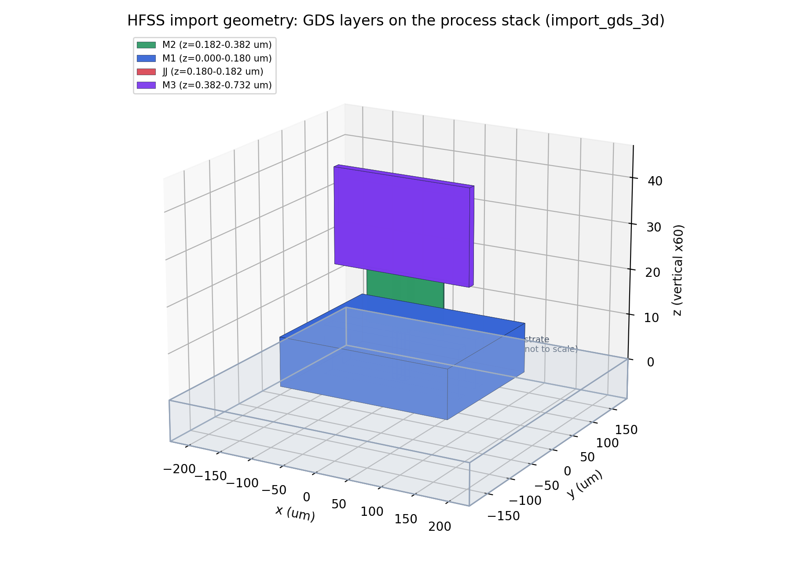

| GDS layer | Name | Elevation (um) | Thickness (um) | HFSS material | Q3D material |
| --- | --- | --- | --- | --- | --- |
| 3 | M1 | 0.000 | 0.180 | PEC | copper |
| 4 | JJ | 0.180 | 0.002 | AlOx ($\varepsilon_r$ 9) | AlOx |
| 5 | M2 | 0.182 | 0.200 | PEC | copper |
| 6 | M3 | 0.382 | 0.350 | PEC | copper |
| 7 | VIA12 | 0.732 | 0.200 | PEC | copper |
| 8 | VIA23 | 0.932 | 0.250 | PEC | copper |

Substrate: high-resistivity silicon, $\varepsilon_r$ 11.45, 500 um.

### Generated project (real, license-free)

```powershell
py -3 -m uv sync --extra hfss
py -3 -m uv run python -c "from text_to_gds.server import export_pyaedt_project; print(export_pyaedt_project('workspace/artifacts/readiness_demo.gds', sidecar_path='workspace/artifacts/readiness_demo.sidecar.json', output_name='readiness_demo'))"
```

Returns `status: prepared` and writes a config plus two PyAEDT scripts that
compile and embed the current API (`import_gds_3d`, `create_setup`,
`create_linear_count_sweep`, `export_touchstone`, `create_fieldplot_volume`;
`Q3d` + `export_matrix_data`). The generated setup for `readiness_demo`:

- Ports: `rf_in`, `rf_out` (lumped, 50 ohm), flagged `review_required`.
- Driven sweep: 1-12 GHz, 221 points, 12 adaptive passes, $\Delta S$ 0.02.
- Eigenmode: 4 modes from 3 GHz.

### Simulation result (requires licensed AEDT)

A `run=True, solve=True` run populates this schema; the targets are what
`run_pyaedt_benchmarks` checks a solved result against (from published devices):

| Benchmark | Analysis | Result key | Target | Tolerance |
| --- | --- | --- | --- | --- |
| `07_hfss_resonator` | HFSS eigenmode | `frequency_ghz`, `quality_factor` | 6.0 GHz, 20000 | 1% / 10% |
| `08_hfss_jpa` | HFSS driven-modal | `frequency_ghz`, `impedance_ohm` | 6.0 GHz, 50 ohm | 1% / 5% |
| `09_hfss_idc` | Q3D capacitance | `capacitance_pf` | 0.6 pF | 3% |

Without a license the suite is honest about it:

```text
run_pyaedt_benchmarks -> status: prepared, counts: {passed: 0, failed: 0, skipped: 3}
```

Solved runs also export `.s2p` (driven-modal S-parameters), an eigenmode JSON
(`f0`, `Q`), a Q3D capacitance CSV, and `Efield.png` / `Hfield.png` /
`current_density.png` field images.

### openEMS FDTD cross-check (real, no license)

The same CPW geometry runs on the open-source openEMS FDTD solver, which produces
the same class of S-parameter / impedance outputs that HFSS driven-modal does.
This is the runnable validation of the EM path on an unlicensed machine:

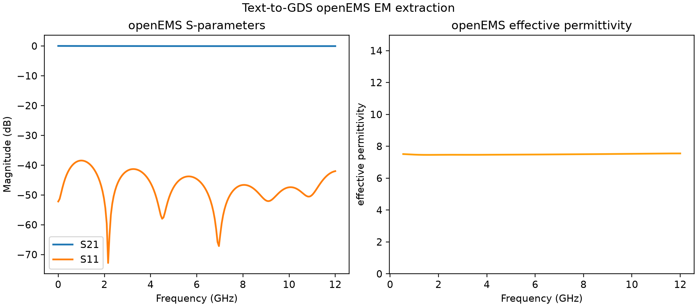

| Quantity | openEMS FDTD (`readiness_demo`) |
| --- | --- |
| Effective permittivity (mid-band) | 7.48 |
| Characteristic impedance $Z_0$ (estimate) | 49.7 ohm |
| Return loss $S_{11}$ (mid-band) | -44.7 dB |
| Insertion loss $S_{21}$ (mid-band) | -0.047 dB |
| Frequency band / points | 0-12 GHz / 201 |
| E-field VTK dumps written | 73 |

Generated lumped-port sheets, mesh convergence, substrate loss tangents, and the
default PEC/copper conductor substitutions are mandatory review gates. They are
not signoff evidence until replaced with calibrated process models, and openEMS
uses a microstrip-port approximation of the CPW pending coplanar ports and a
kinetic-inductance metal model (see `export_superconducting_material`).

## Open-Source EM Solvers (Palace, Elmer, FastHenry/FastCap, gmsh)

Beyond openEMS, Text-to-GDS routes to a full open-source EM stack so the HFSS/Q3D
functions have a free counterpart for every analysis type. All share the same
GDS-on-process-stack contract. gmsh is pip-installable and runs locally; the
FEM/parasitic solvers generate runnable inputs and execute when their binaries are
present, skipping cleanly otherwise (the same contract as HFSS).

| Backend | Method | Commercial analog | Output | Runs here? |
| --- | --- | --- | --- | --- |
| openEMS | FDTD | HFSS driven-modal | S-params, $Z_0$, $\varepsilon_{\text{eff}}$, E-field | yes |
| Palace | 3D FEM eigenmode | HFSS eigenmode | $f_0$, $Q$, energy, participation | mesh yes / solve via WSL |
| Elmer | electrostatic FEM | Q3D Extractor | capacitance matrix $C_{ij}$ | mesh yes / solve when installed |
| FastHenry | partial-element | Q3D (inductance) | $L$, $R$ | when installed |
| FastCap | BEM panels | Q3D (capacitance) | $C$ matrix | when installed |
| gmsh | mesher | (HFSS mesher) | `.msh` tet mesh | yes |

### gmsh mesh (real, runs here)

`export_mesh` extrudes the GDS layers onto the process stack and tetrahedralizes
them with gmsh (`uv pip install gmsh`). On `readiness_demo` it produced a real mesh
that Palace and Elmer consume:

| Quantity | Value |
| --- | --- |
| Nodes | 3665 |
| Tetrahedra | 13004 |
| Meshed layers | M1, JJ, M2, M3 |
| Mesh file | `.msh` (v2.2), ~0.8 MB |

### Palace eigenmode (HFSS-eigenmode analog)

Palace solves the generalized Maxwell FEM eigenproblem $(K-\omega^2 M)\,x=0$ for the
modal frequency, quality factor $Q=\omega_0 U/P_{\text{loss}}$, and dielectric
participation $p_i=U_i/U_{\text{tot}}$ - the eigenmode quantities openEMS cannot
provide. `export_palace_project` writes a Palace JSON config plus the real gmsh mesh
and returns `status: prepared` (Palace itself solves under WSL/Linux+MPI):

```powershell
py -3 -m uv run python -c "from text_to_gds.server import export_palace_project; print(export_palace_project('workspace/artifacts/readiness_demo.gds', sidecar_path='workspace/artifacts/readiness_demo.sidecar.json', output_name='readiness_demo', target_frequency_ghz=5.0))"
```

### Elmer capacitance (Q3D analog)

Elmer's electrostatic solver evaluates $\nabla\cdot(\varepsilon\nabla\varphi)=0$ and
returns the Maxwell capacitance matrix $C_{ij}=Q_i/V_j$ with stored energy
$W=\tfrac12\sum_{ij}C_{ij}V_iV_j$. `export_elmer_project` writes a `.sif` deck
(one capacitance body per metal) plus the gmsh mesh; `ElmerSolver` populates
`CapacitanceMatrix.dat` when installed.

### FastHenry / FastCap parasitics

FastHenry partitions a conductor into segments and returns $Z=R+j\omega L$ with the
partial inductance $L=\frac{\mu_0 l}{2\pi}\left[\ln\frac{2l}{r}-0.75\right]$; FastCap
solves the BEM panel system $q=P^{-1}\varphi$ for the capacitance matrix.
`export_fasthenry` and `export_fastcap` write the decks (`.inp`, `.lst` + `.qui`
panels) and parse results when the FastFieldSolvers binaries are on PATH.

### Routing

`recommend_em_solver` orders backends by device geometry. A CPW resonator ranks
Sonnet > openEMS > Palace > HFSS > Elmer; a package model puts HFSS and Palace
first. Any backend can run any structure - the order is typical suitability only.

## Example Output

Run the complete local toolchain:

```powershell
py -3 -m uv run python skills\text-to-gds\scripts\text_to_gds_tool.py toolchain --output-name manhattan_jj.gds --jc-ua-per-um2 2.0
```

Generated files:

```text
workspace/artifacts/manhattan_jj.gds
workspace/artifacts/manhattan_jj.layout.png
workspace/artifacts/manhattan_jj.sidecar.json
workspace/artifacts/manhattan_jj.drc.json
workspace/artifacts/manhattan_jj.sidecar.extraction.json
workspace/artifacts/manhattan_jj.magic.magic.json
workspace/artifacts/manhattan_jj.sidecar.simulation.json
workspace/artifacts/manhattan_jj.sidecar.simulation.png
workspace/artifacts/manhattan_jj.sidecar.scientific.png
workspace/artifacts/manhattan_jj.sidecar.scientific.svg
workspace/artifacts/manhattan_jj.sidecar.scientific.csv
workspace/artifacts/manhattan_jj.s2p
workspace/artifacts/manhattan_jj.rf.png
workspace/artifacts/manhattan_jj.rf.csv
workspace/artifacts/manhattan_jj.rf.json
workspace/artifacts/manhattan_jj.stack3d.html
workspace/artifacts/manhattan_jj.layout.svg
workspace/artifacts/manhattan_jj.layout.dxf
workspace/artifacts/manhattan_jj.stack.stl
workspace/artifacts/manhattan_jj.stack.glb
workspace/artifacts/manhattan_jj.cad.json
```

Example layout screenshot:


Representative output:

```json
{
  "compile": {
    "status": "compiled",
    "gds_path": "workspace/artifacts/manhattan_jj.gds",
    "screenshot_path": "workspace/artifacts/manhattan_jj.layout.png",
    "sidecar_path": "workspace/artifacts/manhattan_jj.sidecar.json"
  },
  "drc": {
    "schema": "text-to-gds.drc.v0",
    "engine": "klayout_python_bbox",
    "ruleset": "builtin_min_bbox_width",
    "status": "passed",
    "checked_shapes": 3,
    "violations": []
  },
  "simulation": {
    "schema": "text-to-gds.simulation.v0",
    "engine": "mock_jj",
    "junction_area_um2": 0.0484,
    "jc_ua_per_um2": 2.0,
    "critical_current_ua": 0.0968,
    "josephson_inductance_ph": 3399.855149,
    "shunt_capacitance_ff": 0.0,
    "scientific_plot_path": "workspace/artifacts/manhattan_jj.sidecar.scientific.png",
    "physical_performance": {
      "analysis_type": "ideal_jj_small_signal",
      "ports": {
        "input": { "name": "bottom_west", "center": [-6.0, 0.0], "layer": [3, 0] },
        "output": { "name": "bottom_east", "center": [6.0, 0.0], "layer": [3, 0] }
      }
    }
  }
}
```

Export CAD/interchange files from any generated GDS:

```powershell
py -3 -m uv run python skills\text-to-gds\scripts\text_to_gds_tool.py cad-export workspace\artifacts\manhattan_jj.gds
```

Export a scientific plot/data package from a simulation JSON:

```powershell
py -3 -m uv run python skills\text-to-gds\scripts\text_to_gds_tool.py scientific-plot workspace\artifacts\manhattan_jj.sidecar.simulation.json --title "Manhattan JJ Ic/Lj"
```

Run a local Jc sweep with plotted physical metrics:

```powershell
py -3 -m uv run python skills\text-to-gds\scripts\text_to_gds_tool.py sweep workspace\artifacts\manhattan_jj.sidecar.json --sweep-parameter jc_ua_per_um2 --start 1 --stop 4 --points 7
```

The full example output shape is documented in
[examples/example_output.md](examples/example_output.md).

Constraint-driven design request examples are documented in
[examples/design_requests.md](examples/design_requests.md).

Simulator selection and LJPA paper references are documented in
[docs/simulation_tools.md](docs/simulation_tools.md).

Optional upstream research adapter details are documented in
[docs/research_integrations.md](docs/research_integrations.md).

Run a real JoSIM transient after compiling a layout:

```powershell
py -3 -m uv run python skills\text-to-gds\scripts\text_to_gds_tool.py simulate workspace\artifacts\manhattan_jj.sidecar.json --simulator josim --jc-ua-per-um2 2.0
```

That writes a `.josim.cir` starter deck, a `.josim.csv` transient output file,
and records parsed voltage/phase rows in `.josim.json`.

Run a real ngspice starter deck after compiling a layout:

```powershell
py -3 -m uv run python skills\text-to-gds\scripts\text_to_gds_tool.py simulate workspace\artifacts\manhattan_jj.sidecar.json --simulator ngspice --jc-ua-per-um2 2.0
```

For standalone JJ sidecars, this writes a linearized `Lj` plus
shunt-capacitance transient deck. For LJPA sidecars, it writes a small-signal
two-port RLC deck. When ngspice executes successfully, the adapter writes
`.ngspice.cir`, `.ngspice.dat`, `.ngspice.json`, `.simulation.json`, and
`.simulation.png`.

Validated ngspice JJ smoke result on this Windows setup:

```text
adapter_status: executed
returncode: 0
parsed transient rows: 255
critical_current_ua: 0.0968
josephson_inductance_ph: 3399.855149
input port: bottom_west, layer [3, 0], center [-6.0, 0.0]
output port: bottom_east, layer [3, 0], center [6.0, 0.0]
```

Run a real JosephsonCircuits.jl harmonic-balance simulation for an LJPA sidecar:

```powershell
py -3 -m uv run python skills\text-to-gds\scripts\text_to_gds_tool.py simulate workspace\artifacts\ljpa_seed.sidecar.json --simulator JosephsonCircuits.jl --analysis-mode auto --jc-ua-per-um2 2.0 --target-frequency-ghz 5.0 --target-bandwidth-mhz 500 --target-gain-db 20
```

For `lumped_element_jpa_seed`, `auto` selects the two-port LJPA starter and
records `s_parameters_db.s11_db`, `s21_db`, `s12_db`, `s22_db`,
`peak_s21_gain_db`, `center_s21_gain_db`, and `bandwidth_3db_mhz` in the
JosephsonCircuits result JSON. For a standalone JJ sidecar, `auto` falls back
to the single-port reflection starter.

The built-in and external KLayout DRC paths are documented in
[docs/klayout_drc.md](docs/klayout_drc.md).

The intended local workbench UX is documented in
[docs/ui_ux_workflow.md](docs/ui_ux_workflow.md).

Run the first-pass LJPA workflow from the prompt in this README:

```powershell
py -3 -m uv run python skills\text-to-gds\scripts\text_to_gds_tool.py design-workflow "Design a 5 Ghz LJPA with wilde bandwidth" --output-name ljpa_seed.gds --jc-ua-per-um2 2.0
```

That command writes `workspace/artifacts/ljpa_seed.workbench.html`, which can
be opened locally in a browser.

Run the same workflow with the real ngspice adapter and explicit performance
reporting:

```powershell
py -3 -m uv run python skills\text-to-gds\scripts\text_to_gds_tool.py design-workflow "Design a 5 GHz LJPA with 500 MHz bandwidth, 20 dB gain, and report input/output ports" --output-name ljpa_ngspice_verified.gds --jc-ua-per-um2 2.0 --simulator ngspice
```

Verified output from that command:

```text
status: completed_with_external_simulation
ngspice_status: executed
ngspice_rows: 81
Magic status: executed_with_warnings

Input port: rf_in, center [-105.0, 0.0], width 10.0 um, layer [6, 0]
Output port: rf_out, center [105.0, 0.0], width 10.0 um, layer [6, 0]

Estimated peak gain: 20.0 dB
3 dB bandwidth: 500.0 MHz
Loaded Q: 10.0
Estimated input P1dB / saturation power: -112.141 dBm
Quantum-limited noise temperature: 0.119981 K

Layout screenshot: workspace/artifacts/ljpa_ngspice_verified.layout.png
Workbench: workspace/artifacts/ljpa_ngspice_verified.workbench.html
Simulation JSON: workspace/artifacts/ljpa_ngspice_verified.sidecar.simulation.json
Simulation plot: workspace/artifacts/ljpa_ngspice_verified.sidecar.simulation.png
```

The saturation/P1dB value above is a first-order layout-derived estimate. Use
JosephsonCircuits.jl harmonic balance or measured data for publication-grade
compression power.

Run the same prompt-to-layout workflow with the real JoSIM adapter:

```powershell
py -3 -m uv run python skills\text-to-gds\scripts\text_to_gds_tool.py design-workflow "Design a 5 Ghz LJPA with wilde bandwidth" --output-name ljpa_josim.gds --jc-ua-per-um2 2.0 --simulator josim
```

When JoSIM is installed, the workflow status is
`completed_with_external_simulation` and the simulation result includes parsed
transient rows from `.josim.csv`.

Run the live local browser UI:

```powershell
py -3 -m uv run python skills\text-to-gds\scripts\text_to_gds_tool.py ui --host 127.0.0.1 --port 8765
```

Then open `http://127.0.0.1:8765`. The page accepts prompt edits, simulator
selection, JosephsonCircuits analysis controls, pump/capacitance parameters,
and can run the normal or optimized local workflow. It displays the layout PNG,
interactive 3D stack preview, Python simulation plot, generated workbench,
artifacts, metrics, and JSON response.

## Research Integrations

Text-to-GDS treats the major open-source quantum/EDA projects as real local
adapters, not copied code. Each adapter executes the actual upstream library
when it is installed and otherwise reports `skipped` with an install hint.
Check the local status:

```powershell
py -3 -m uv run python skills\text-to-gds\scripts\text_to_gds_tool.py research-integrations
```

The adapters and how they execute:

| Upstream project | Text-to-GDS role | Execution |
| --- | --- | --- |
| gdsfactory | Primary PCell/GDS engine and process-friendly layout API. | Real (core dependency) |
| JosephsonCircuits.jl | Nonlinear JPA/JTWPA harmonic balance for gain, S-parameters, quantum efficiency, noise, squeezing, and stability. | Real `hbsolve` via local Julia |
| scikit-rf | Touchstone/S-parameter inspection and port/Z0 review. | Real `skrf.Network` when installed |
| openEMS | CPW/microstrip EM extraction for `Z0`, effective permittivity, S-parameters, and E-field maps. | Real FDTD (Windows: dedicated Python 3.11 venv) |
| Optuna | Constrained optimizer for gain, bandwidth, frequency, and P1dB targets. | Real TPE study (grid fallback) |
| Qiskit Metal | `QComponent` -> geometry -> renderer -> GDS, plus architecture bridge. | Real `QDesign`+GDS where importable* |
| scqubits | Transmon/Fluxonium Hamiltonian from layout-derived `EJ`/`EC`, with flux/charge spectra. | Real diagonalization when installed |
| QCoDeS | VNA/pump/flux measurement plan recorded into a real experiment database. | Real station + SQLite dataset |

\* Qiskit Metal cannot be pip-installed on Windows/Python 3.12 (PySide2 has no
matching wheel); use conda or a Python &le;3.10 environment. The adapter skips
cleanly otherwise. See [docs/simulation_tools.md](docs/simulation_tools.md) for
the openEMS Windows setup and full execution notes.

After running `design-workflow`, export RF network data:

```powershell
py -3 -m uv run python skills\text-to-gds\scripts\text_to_gds_tool.py rf-export workspace\artifacts\ljpa_seed.sidecar.simulation.json --output-name ljpa_seed
```

Generated RF files:

```text
workspace/artifacts/ljpa_seed.s2p
workspace/artifacts/ljpa_seed.rf.png
workspace/artifacts/ljpa_seed.rf.csv
workspace/artifacts/ljpa_seed.rf.json
```

Run real EM, lab, and quantum-model executions (each runs the upstream library
when installed):

```powershell
# openEMS FDTD: S11/S21, effective permittivity, Z0 estimate, E-field VTK dumps
py -3 -m uv run python skills\text-to-gds\scripts\text_to_gds_tool.py openems-project workspace\artifacts\ljpa_seed.sidecar.json --output-name ljpa_seed

# QCoDeS: real station + SQLite dataset from a mock-VNA sweep (no hardware)
py -3 -m uv run python skills\text-to-gds\scripts\text_to_gds_tool.py measurement-plan workspace\artifacts\ljpa_seed.sidecar.json --simulation-path workspace\artifacts\ljpa_seed.sidecar.simulation.json --output-name ljpa_seed

# scqubits: diagonalize a real Transmon/TunableTransmon, plot the spectrum
py -3 -m uv run python skills\text-to-gds\scripts\text_to_gds_tool.py hamiltonian-model workspace\artifacts\ljpa_seed.sidecar.json --jc-ua-per-um2 2.0 --flux-bias-phi0 0.25 --output-name ljpa_seed

# Qiskit Metal: build a real QDesign + QComponent and render GDS (where importable)
py -3 -m uv run python skills\text-to-gds\scripts\text_to_gds_tool.py quantum-metal-bridge workspace\artifacts\ljpa_seed.sidecar.json --output-name ljpa_seed
```

Run the advanced JPA analysis and the full scientific report (both drive real
JosephsonCircuits.jl harmonic balance):

```powershell
# Pump sweep -> gain, P1dB, quantum efficiency, noise temperature, squeezing, stability
py -3 -m uv run python skills\text-to-gds\scripts\text_to_gds_tool.py jpa-analysis workspace\artifacts\ljpa_seed.sidecar.json --jc-ua-per-um2 6.8 --target-frequency-ghz 5.0 --target-bandwidth-mhz 500

# Ten-figure composite report (real panels labelled josephsoncircuits_real)
py -3 -m uv run python skills\text-to-gds\scripts\text_to_gds_tool.py scientific-report workspace\artifacts\ljpa_seed.sidecar.json --jc-ua-per-um2 6.8 --target-frequency-ghz 5.0
```

Run constrained research optimization. If Optuna is installed, it uses a real
TPE study; otherwise it writes the same artifact family from a deterministic
local grid:

```powershell
py -3 -m uv run python skills\text-to-gds\scripts\text_to_gds_tool.py research-optimize workspace\artifacts\ljpa_seed.sidecar.json --n-trials 24 --target-frequency-ghz 5.0 --target-gain-db 20 --target-bandwidth-mhz 500 --min-p1db-dbm -100 --output-name ljpa_seed
```

Verify each upstream library actually executes on your machine:

```powershell
py -3 -m uv run pytest tests/test_research_execution.py -q
# include the slow Julia/openEMS paths:
$env:TEXT_TO_GDS_RUN_EXTERNAL = "1"; py -3 -m uv run pytest tests/test_research_execution.py -q
```

These adapters run the real upstream tools, but the generated circuit/EM models
are layout-derived starters. Publication or tapeout still needs calibrated
process data, extracted parasitics, EM mesh validation, and measured device
data.

## Simulation Results

The figures below are produced by the real adapters, not mockups. They were
generated from the `lumped_element_jpa_seed` sidecar with a SQUID active element
at a 5 GHz target (`--jc-ua-per-um2 6.8`, which lands the junction in the
~1000 pH parametric-gain regime).

### Closed-loop readiness: 0 -> 100

`run_validation_checklist` now scores a gated technology-readiness level (TRL)
across the whole pipeline. The table below is a real run on one 5 GHz flux-tuned
LJPA: each row adds the next stage's genuine artifact and re-scores. The score
climbs from 0% (a prompt) to 100% (a measurement-correlated design) only as real
evidence accumulates; the TRL is *gated*, so a later stage cannot raise it past
an unmet upstream stage.

| Pipeline stage added | Readiness | Technology readiness level |
| --- | --- | --- |
| Prompt only (concept) | 0.0% | TRL 1/9 - Concept only |
| + Layout: GDS + sidecar + CAD (gdsfactory) | 16.7% | TRL 2/9 - Layout generated |
| + DRC (KLayout) | 33.3% | TRL 3/9 - Design-rule clean |
| + Extraction + harmonic balance (JosephsonCircuits.jl) | 66.7% | TRL 5/9 - Circuit simulation evidence |
| + EM extraction (openEMS FDTD) | 83.3% | TRL 6/9 - EM-extraction validated |
| + Measurement fit (VNA resonator) | 100.0% | TRL 7/9 - Measurement-correlated design |

Every stage above ran a real tool: gdsfactory layout, KLayout DRC, a
JosephsonCircuits.jl `hbsolve` harmonic balance, an openEMS FDTD extraction
(effective permittivity ~7.5 from the propagation constant), and a SciPy-refined
notch fit of an example measured VNA trace (recovered `f0` = 5.0000 GHz,
`Qi` ~ 1.7e5, `Qc` ~ 1.2e5). Reproduce it with:

```powershell
py -3 -m uv run python skills\text-to-gds\scripts\text_to_gds_tool.py design-workflow "Design a 5 GHz LJPA with flux tuning, 500 MHz bandwidth, 20 dB gain" --output-name readiness_demo.gds --jc-ua-per-um2 6.8 --flux-bias-phi0 0.25 --squid-asymmetry 0.05 --flux-period-current-ma 2.0 --simulator JosephsonCircuits.jl
py -3 -m uv run python skills\text-to-gds\scripts\text_to_gds_tool.py openems-project workspace\artifacts\readiness_demo.sidecar.json --output-name readiness_demo
py -3 -m uv run python -c "from text_to_gds.server import fit_measurement; print(fit_measurement('workspace/artifacts/readiness_demo_measured_s21.csv', fit_kind='resonator', output_name='readiness_demo', device_id='LJPA-demo'))"
py -3 -m uv run python -c "from text_to_gds.server import run_validation_checklist; print(run_validation_checklist(sidecar_path='workspace/artifacts/readiness_demo.sidecar.json', em_path='workspace/artifacts/readiness_demo.openems.json', measurement_path='workspace/artifacts/readiness_demo.fit.json')['readiness'])"
```

In this toolkit the TRL caps at 7; TRL 8-9 require system qualification beyond
layout, EM, and bench-measurement artifacts.

### Scientific report (ten figures)

`export_scientific_report` assembles the full figure set into one composite.
Six panels (Gain, Pump sweep, P1dB, Noise temperature, Squeezing, Stability) are
computed by real JosephsonCircuits.jl harmonic balance; flux tuning uses the
SQUID model; S11/S21 and bandwidth are layout surrogates.

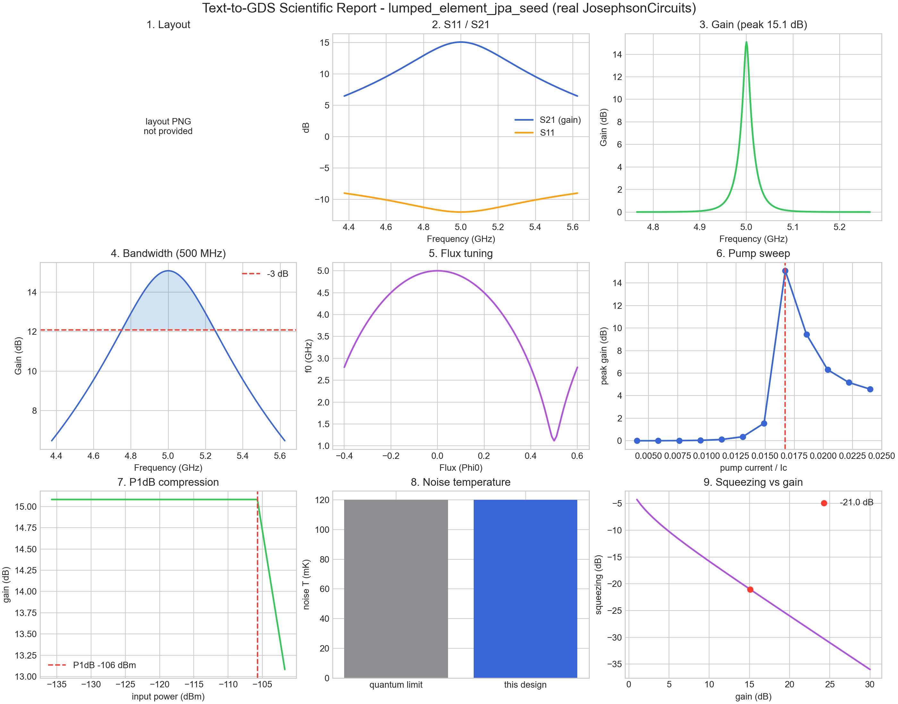

### Advanced JPA analysis (real JosephsonCircuits.jl pump sweep)

`export_jpa_analysis` runs one `hbsolve` per pump current and post-processes the
gain and quantum efficiency into the parametric-amplifier figures.

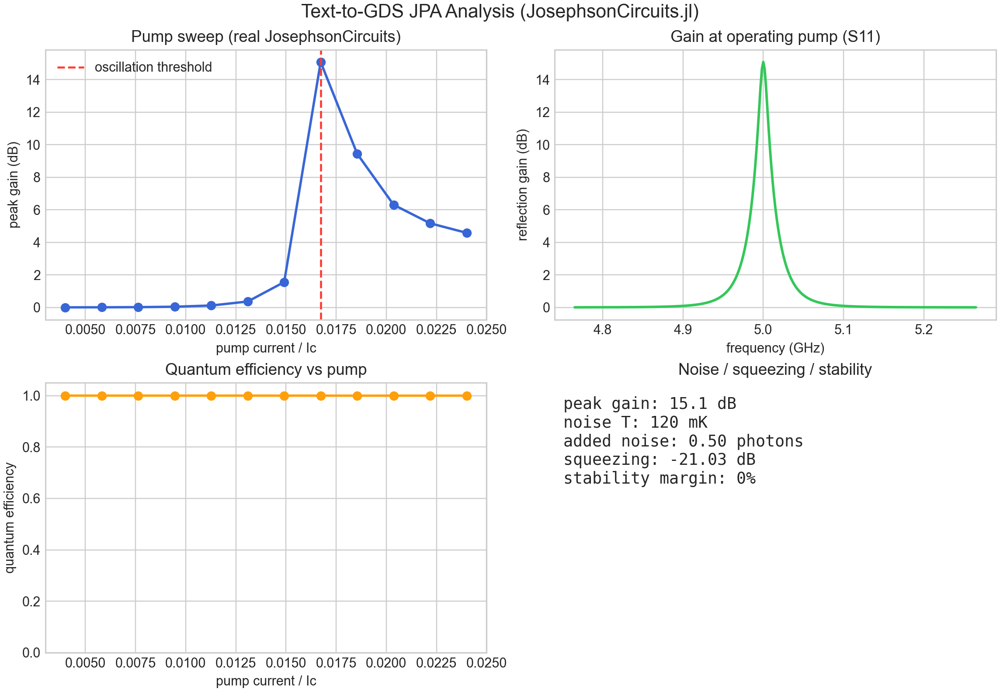

| Metric | Value | Source |
| --- | --- | --- |
| Peak gain | 15.1 dB | JosephsonCircuits.jl `hbsolve` |
| Quantum efficiency | 1.00 (quantum-limited) | `QE`/`QEideal` outputs |
| Noise temperature | 120 mK | quantum limit / efficiency |
| Added noise | 0.50 photons | from efficiency |
| Squeezing | -21.0 dB | ideal degenerate-paramp from peak gain |
| Oscillation threshold | pump current / Ic = 0.0167 | gain maximum in the pump sweep |

### openEMS EM extraction (real FDTD)

`export_openems_project` runs a microstrip-port FDTD model and extracts the
S-parameters and effective permittivity (plus E-field VTK dumps to disk).

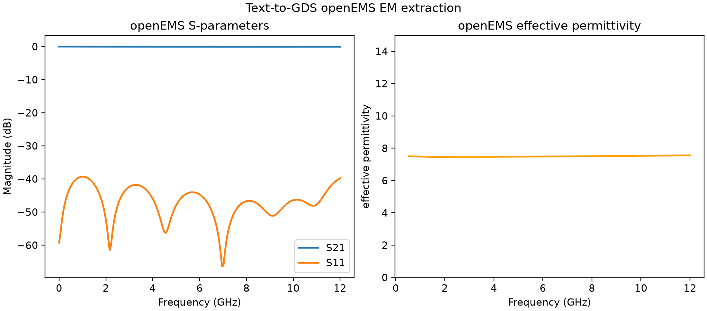

| Metric | Value |
| --- | --- |
| Effective permittivity (mid-band) | 7.48 (silicon, epr 11.45) |
| Insertion loss S21 | -0.05 dB |
| Characteristic impedance (estimate) | 49.7 ohm |
| E-field VTK dumps written | 72 files |

### scqubits Hamiltonian spectrum (real diagonalization)

`export_hamiltonian_model` builds a real `TunableTransmon`, diagonalizes it, and
plots the energy levels and the flux-dispersion spectrum.

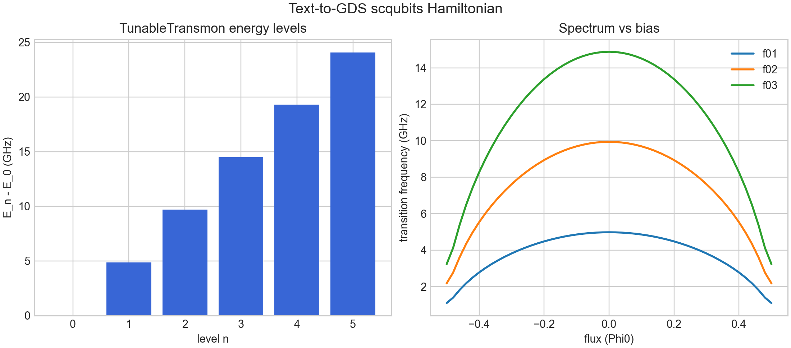

| Metric | Value |
| --- | --- |
| Qubit model | `TunableTransmon` |
| f01 | 4.86 GHz |
| Anharmonicity | -20.3 MHz |

## Benchmarks

Benchmarks are lightweight text prompts plus expected artifact families. They
mirror the role of `text-to-cad` benchmarks, but use GDS, sidecar, DRC, and
simulation outputs instead of STEP or mesh previews. The `Expected layout`
column renders the expected output layout screenshot PNG.

| # | Target | Prompt | Expected layout |
| --- | --- | --- | --- |
| 1 | [Manhattan Josephson Junction](benchmarks/01-manhattan-josephson-junction.md) | Create a Manhattan JJ with default layers, run DRC, and estimate `Ic` and `Lj` for `Jc = 2.0 uA/um^2`. | 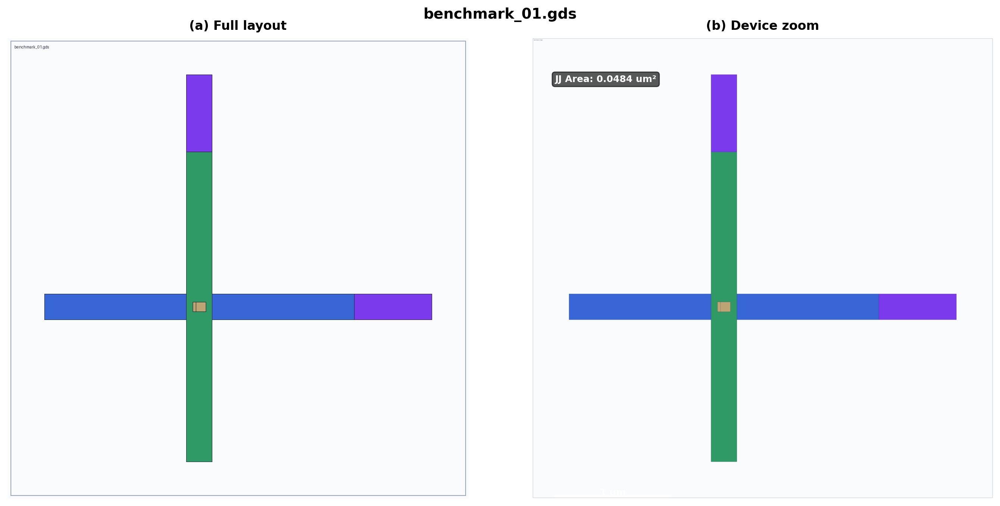 |
| 2 | [Compact CMOS Logic Cell](benchmarks/02-compact-cmos-logic-cell.md) | Fit active logic inside `$5 \mu m \times 5 \mu m$`, use M1/M2/M3 routing, and target sub-50 ps delay with under-100 nW leakage. | 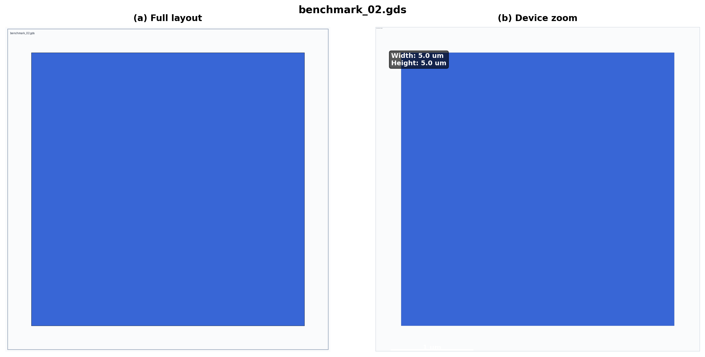 |
| 3 | [SFQ Pulse Splitter](benchmarks/03-sfq-pulse-splitter.md) | Route a superconducting splitter with branch `Ic`, output skew, and min-width targets. | 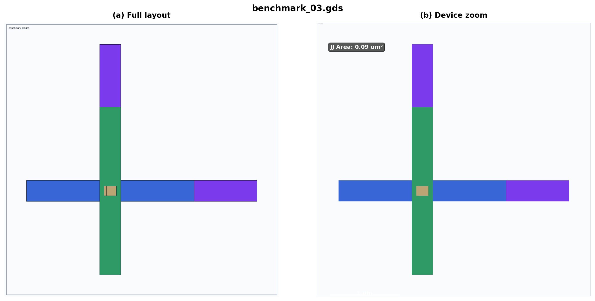 |
| 4 | [JJ IC Calibration Array](benchmarks/04-jj-ic-calibration-array.md) | Sweep JJ areas and report expected critical current from sidecar metadata. | 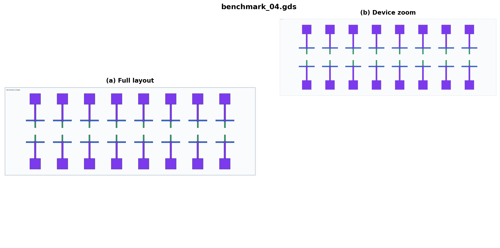 |
| 5 | [CPW Resonator Test Structure](benchmarks/05-cpw-resonator-test.md) | Layout a CPW resonator with frequency, coupling-Q, and gap targets. | 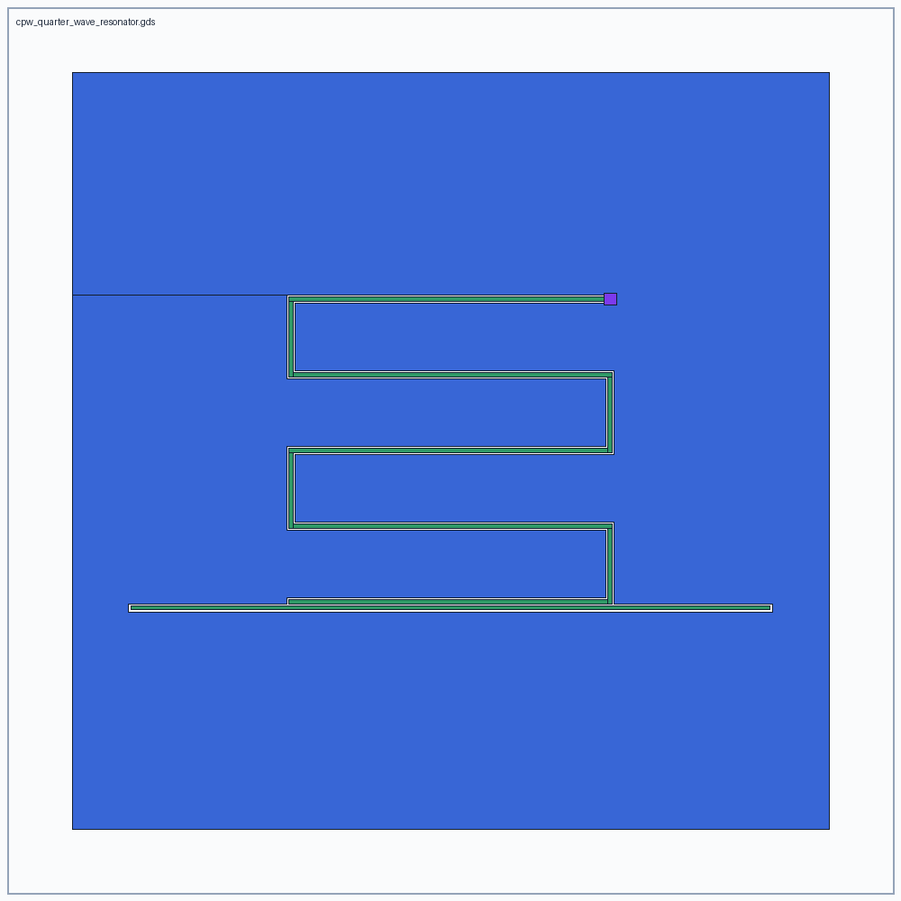 |
| 6 | [Via-Chain Process Monitor](benchmarks/06-via-chain-monitor.md) | Build a 100-stage via-chain monitor with landing-pad, resistance, and topology targets. | 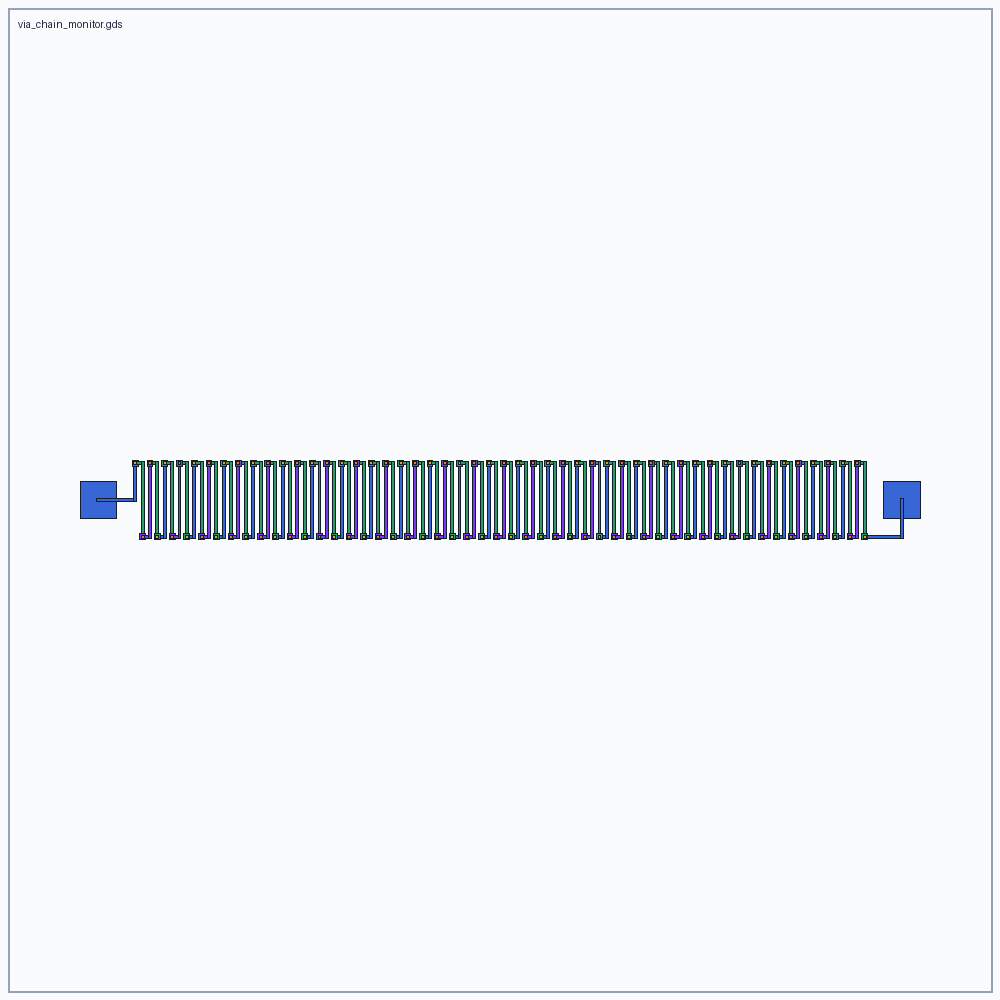 |

## Simulation Model

The default simulation is intentionally small and deterministic. It is a
correct ideal Josephson Junction calculation for zero-phase, small-signal
inductance. JoSIM, ngspice, and JosephsonCircuits.jl are local external adapters:
Text-to-GDS reports whether their executables are available, writes and runs a
JoSIM transient starter deck or ngspice starter deck when requested, and
writes/runs a JosephsonCircuits.jl harmonic-balance starter model. LJPA
sidecars use a two-port lumped model for JosephsonCircuits.jl that extracts
S11/S21/S12/S22 gain arrays; simple JJ sidecars use the single-port reflection
model. Text-to-GDS does not claim those tools ran unless they are actually
executed locally.

Every `run_simulation` call also writes a Python-rendered `.simulation.png`.
For JosephsonCircuits.jl multiport runs, the plot draws S-parameter gain curves.
For JoSIM and ngspice runs, it draws the first parsed output column pair. For
ideal JJ runs, it draws a compact `Ic`/`Lj` summary.

Every simulation JSON also includes `physical_performance`. For an LJPA sidecar,
that section includes:

- `ports.input` and `ports.output`
- `center_frequency_ghz`
- `estimated_peak_gain_db`
- `bandwidth_3db_mhz`
- `loaded_q`
- `estimated_input_1db_compression_dbm`
- `estimated_saturation_power_dbm`
- `quantum_limited_noise_temperature_k`
- `pump_current_ua`
- `resonator_capacitance_ff`
- `coupling_capacitance_ff`

For a via-chain monitor sidecar, `physical_performance` reports stage count,
input/output ports, estimated total resistance, via resistance, metal
resistance, and whether the generated topology is open.

Inputs:

- junction area: `A` in `um^2`
- critical current density: `Jc` in `uA/um^2`

Critical current:

```text
Ic_uA = A_um2 * Jc_uA_per_um2
```

Josephson inductance:

```text
Lj_H = Phi0 / (2 * pi * Ic_A)
Lj_pH = Lj_H * 1e12
Phi0 = 2.067833848e-15 Wb
```

For the default Manhattan JJ:

```text
A = 0.22 um * 0.22 um = 0.0484 um^2
Jc = 2.0 uA/um^2
Ic = 0.0968 uA
Lj = 3399.855149 pH
```

The tests assert these values.

For `lumped_element_jpa_seed`, the active element is now an explicit
two-junction `dc_squid_pair`. Text-to-GDS applies the low-loop-inductance
dc-SQUID Aharonov-Bohm flux modulation:

```text
Ic_eff(Phi) = Ic0 * sqrt(cos(pi * Phi/Phi0)^2 + d^2 * sin(pi * Phi/Phi0)^2)
Lj(Phi) = Phi0 / (2 * pi * Ic_eff(Phi))
f0(Phi) = 1 / (2 * pi * sqrt(Lj(Phi) * C_res))
```

where `Ic0` is the total zero-flux SQUID critical current and
`d = abs(Ic1 - Ic2) / (Ic1 + Ic2)` is the junction asymmetry. Run it from the
CLI:

```powershell
py -3 -m uv run python skills\text-to-gds\scripts\text_to_gds_tool.py design-workflow "Design a 5 GHz LJPA with flux tuning" --output-name flux_tuned_ljpa.gds --jc-ua-per-um2 2.0 --flux-bias-phi0 0.25 --squid-asymmetry 0.05 --flux-period-current-ma 2.0
```

Representative output from `workspace/artifacts/flux_tuned_ljpa.sidecar.simulation.json`:

```text
zero_flux_critical_current_ua: 0.1936
critical_current_ua at 0.25 Phi0: 0.1370668859
josephson_inductance_ph at 0.25 Phi0: 2401.0611778
flux_tuned_resonant_frequency_ghz: 4.2071074176
coil_current_ma: 0.5
flux_period_current_ma: 2.0
tuning_range_ghz: 1.1180339887 to 5.0
```

The same workflow also writes
`workspace/artifacts/flux_tuned_ljpa.validation.json`, which follows
`Text-to-GDS_Academic_Industrial_Validation_Roadmap.md`.

## Repository Structure

```text
Text-to-Layout/
|-- .codex-plugin/
|-- .claude-plugin/
|-- .github/
|-- assets/
|-- benchmarks/
|-- docs/
|-- drc/
|-- examples/
|-- plugins/
|   `-- text-to-gds/
|-- scripts/
|-- skills/
|   |-- text-to-gds/
|   |-- text-to-gds-circuit-design/
|   |-- text-to-gds-layout-design/
|   |-- text-to-gds-signoff/
|   `-- text-to-gds-simulation/
|-- src/
|   `-- text_to_gds/
|-- tests/
`-- workspace/
    `-- artifacts/
```

## Current Limits

- `run_drc` is a built-in KLayout Python geometry scan, not a full process DRC
  deck. Add a real KLayout `.drc` deck before foundry use.
- `run_process_drc` attempts external `klayout -b` first. If that executable is
  missing or cannot execute the deck, it falls back to headless KLayout Python
  process rules and records the external command/warnings in the JSON report.
- `run_simulation` computes ideal JJ quantities by default. It can execute a
  real JoSIM transient deck, real ngspice starter deck, and
  JosephsonCircuits.jl harmonic-balance starter models when the local tools are
  installed. The LJPA JosephsonCircuits starter is two-port and reports
  S-parameter gain arrays, but full phase bias, parasitics, CPW impedance,
  noise response, and calibrated pump operating points still require richer
  extracted circuit models and measured process data.
- `physical_performance` contains first-order estimates for LJPA gain,
  bandwidth, loaded Q, noise temperature, saturation/P1dB, and low-inductance
  SQUID flux tuning. Treat those as iteration guidance until replaced by
  harmonic-balance, EM extraction, or measured results.
- The layer map is a placeholder superconducting stack and must be replaced by
  a real process file before tapeout or publication of process-specific claims.
- The 2.5D preview is a local UX/review aid based on layer bounding boxes, not a
  field solver or electromagnetic model.
- The optimizer is a deterministic local surrogate for first-pass geometry. It
  is not a replacement for simulator-backed gain/noise/bandwidth optimization.
  `run_research_optimization` can use Optuna when installed, but the default
  objective is still a layout-derived surrogate until wired to external
  JosephsonCircuits/openEMS results.
- `export_rf_network` writes magnitude-only Touchstone with zero phase unless
  an upstream adapter supplies complex S-parameters. Use it as an RF review
  handoff, not calibrated VNA data.
- `export_openems_project`, `export_measurement_plan`,
  `export_hamiltonian_model`, `export_quantum_metal_bridge`, and
  `export_jpa_analysis` execute the real upstream library when it is installed
  and report `skipped` otherwise. The generated circuit/EM models are
  layout-derived starters (microstrip-port EM, single-port reflection JPA,
  transmon-like Hamiltonian), so treat the numbers as design iteration until
  backed by extracted parasitics, EM mesh validation, and measured data.
  Qiskit Metal cannot be pip-installed on Windows/Python 3.12 (PySide2); the
  adapter runs where `qiskit_metal` is importable and skips cleanly otherwise.
- PySpice is currently a discovery/roadmap adapter. Magic VLSI can execute a
  generated extraction script through `scripts\magic_wsl.py`, but the bundled
  generic `scmos` tech does not understand this superconducting layer map.
  Unknown-layer warnings are expected until a calibrated Magic tech file is
  supplied. ngspice can execute generated starter decks, but those decks are
  layout-derived circuit iteration models, not signoff extraction.

## Contributing

Text-to-GDS is intended to be an open-source project. Issues, pull requests,
PCell contributions, process-deck adapters, and simulator adapters are welcome.

For local contribution workflow, plugin refresh, and validation guidance, see
[CONTRIBUTING.md](CONTRIBUTING.md).

## License

MIT. See [LICENSE](LICENSE).
