# Text-to-Layout

Text-to-Layout converts natural-language chip design requests into typed layout
DSL, deterministic GDS geometry, KLayout-verified artifacts, and honest
simulation evidence — every claim in this README is backed by committed files
and enforced by CI claim validation.

## 30-second demo

One command runs the full closed loop — natural language → intent → tuned Layout DSL → verified geometry → solver preparation (execution if a solver is installed) → honest evidence report:

```bash
textlayout prompt "Create a 0.6 pF IDC on silicon at 6 GHz with 2 um min gap and prepare a JoSIM LC/JJ circuit check" --out out/idc_josim_demo
```

The same eight-file contract is available for the new closed-loop paths:

```bash
textlayout prompt "Design a CPW transmission line on silicon at 6 GHz with 50 ohm impedance" --out out/cpw_demo
textlayout prompt "Create a 3 nH spiral inductor with 4 turns" --out out/spiral_demo
```

Generated files in `out/idc_demo/`:

```text
intent.json          parsed design intent (deterministic parser, no LLM/API key)
layout.json          tuned Layout DSL
output.gds           layout artifact
output.svg           preview
output.png           raster preview
verification.json    geometry + design-rule check results
simulation.json      typed simulation evidence (status vocabulary below)
optimization.json    analytical initialization plus solver-aware tuning iterations
simulation/capacitance/input/   FasterCap/FastCap inputs
simulation/capacitance/output/  retained capacitance solver outputs
simulation/josim/circuit.cir    passive LC transient deck
simulation/josim/circuit_jj.cir JJ-ready transient deck when requested
report.md            target-vs-result report with explicit evidence status
```

`textlayout` is the main product package and owns all new CLI, API, layout,
solver, optimization, and reporting code. `text_to_gds` is legacy compatibility
code and is not the expansion path.

FasterCap/FastCap performs geometry-based electrostatic capacitance extraction.
JoSIM performs superconducting circuit transient simulation. JoSIM is not an EM
or capacitance field solver and cannot prove that physical IDC geometry meets a
capacitance target. Solver input preparation is not solver execution, and an
analytical estimate is not physical verification.

Current committed showcase evidence includes real FasterCap and FastHenry runs:

| Quantity | Target | Solver-extracted | Error | Evidence status |
| --- | --- | --- | --- | --- |
| IDC capacitance | 0.600000 pF | 0.598641 pF | 0.226% | `PHYSICS_VERIFIED` |
| Spiral inductance | 3.000000 nH | 2.751264 nH | 8.291% | `SIMULATION_EXECUTED` (outside the 5% evidence tolerance) |

Example 3 is `PHYSICS_VERIFIED` only for its embedded IDC region. CPW launches,
transitions, resonator behavior, and the full test-chip tile are not full-wave
verified. A solver-owned output must be parsed and compared with its target
before any `PHYSICS_VERIFIED` claim is allowed.

> This project is not fabrication-ready by default. Geometry generation and analytical estimation are supported. Physics verification is only claimed when an external solver is executed and its output is parsed successfully.

## Why this is not AI-random drawing

The natural-language parser is deterministic (no LLM, no API key) and produces
*typed design intent* only. The intent becomes a validated Layout DSL
(pydantic v2), deterministic Python generates every polygon, gdsfactory writes
the GDS, and KLayout — a different code base than the writer — reads the file
back and verifies top cell, bounding box, layers, and per-layer polygon counts.
LangGraph orchestrates the stages and records `workflow_trace.json`, but owns
no geometry and can invent no evidence: a false `PHYSICS_VERIFIED` record is
structurally unconstructible (see `src/textlayout/evidence.py`).

## Workflow

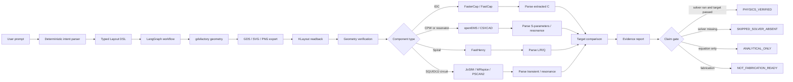

## Installation

```bash
git clone https://github.com/JungluChen/Text-to-Layout
cd Text-to-Layout
python -m venv .venv
source .venv/bin/activate   # Windows: .venv\Scripts\activate
python -m pip install -U pip
pip install -e ".[dev]"
```

Or with `uv`: `py -3 -m uv sync`.

Install the supported WSL FastHenry build with:

```bash
uv run python scripts/install_fasthenry.py
```

## Required dependencies

```text
Python >= 3.11
klayout      (GDS readback verification)
gdsfactory   (geometry construction and export)
langgraph    (workflow orchestration)
```

## Optional external solvers

```text
FasterCap / FastCap  capacitance extraction (WSL builds are auto-detected on Windows)
openEMS              CPW / resonator S-parameters (input preparation is always available)
FastHenry            spiral inductance (input preparation is always available)
JoSIM                Josephson circuit transient simulation — never geometry capacitance evidence
WRspice / PSCAN2     optional circuit cross-checks
```

## Run the doctor

```bash
textlayout doctor
```

Checks Python version, `textlayout`/gdsfactory/KLayout/LangGraph imports,
FasterCap discovery, optional solver availability, and output-directory write
permission. A missing solver is reported as *absent* — execution will be
skipped honestly; it is never an environment failure.

## Six research-grade examples

Generated by `python scripts/generate_showcase_examples.py --force` through the
full LangGraph pipeline; every cell below links to committed artifacts under
[`examples/showcase/`](examples/showcase/) and is enforced by
`scripts/validate_readme_claims.py` and `tests/textlayout_suite/test_showcase_examples.py`.

| # | Target | Prompt | Output | Step Results | Evidence Status |
|---|--------|--------|--------|--------------|-----------------|
| 1 | 0.6 pF IDC | Create a 0.6 pF interdigitated capacitor on silicon at 6 GHz with 2 um minimum gap, 4 um finger width, and two RF ports. | [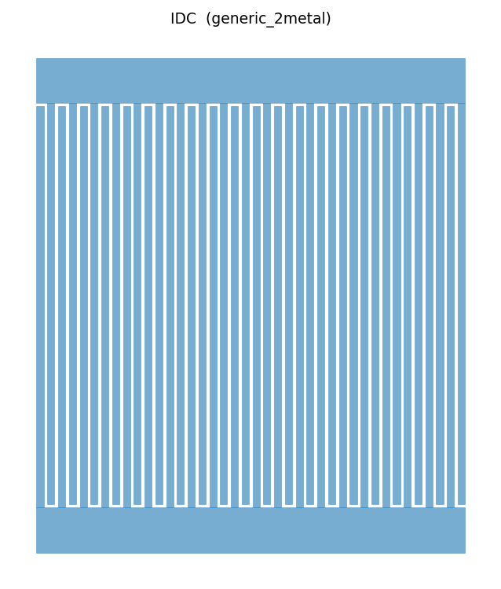](examples/showcase/01_idc_0p6pf/output.svg) | [report](examples/showcase/01_idc_0p6pf/report.md) · [simulation](examples/showcase/01_idc_0p6pf/simulation.json) · [trace](examples/showcase/01_idc_0p6pf/workflow_trace.json) | **PHYSICS_VERIFIED** — FasterCap real execution; extracted 0.598641 pF versus 0.600000 pF target; 0.226% error. **NOT_FABRICATION_READY** |
| 2 | 50 ohm CPW feedline | Create a 50 ohm CPW feedline on silicon at 6 GHz with ground-signal-ground geometry and labeled input/output ports. | [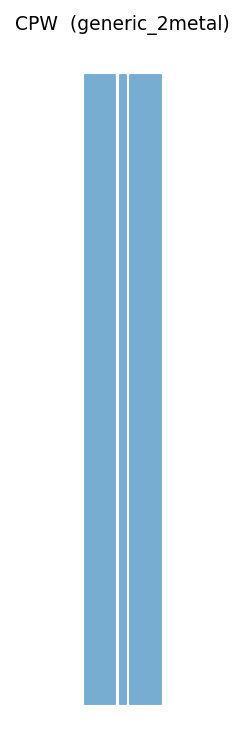](examples/showcase/02_cpw_50ohm/output.svg) | [report](examples/showcase/02_cpw_50ohm/report.md) · [simulation](examples/showcase/02_cpw_50ohm/simulation.json) · [trace](examples/showcase/02_cpw_50ohm/workflow_trace.json) | **SKIPPED_SOLVER_ABSENT** — openEMS/CSXCAD binaries exist, but the required Octave frontend is unavailable; input prepared, no EM run. **NOT_FABRICATION_READY** |
| 3 | IDC + CPW test structure | Create a test structure with a 0.6 pF IDC connected to two 50 ohm CPW feedlines, with GSG-style launch regions, ground clearance, and measurement-friendly port labels. | [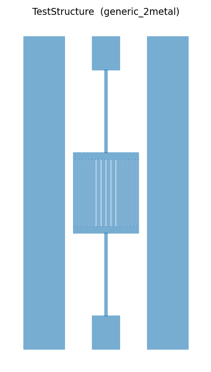](examples/showcase/03_idc_cpw_test_structure/output.svg) | [report](examples/showcase/03_idc_cpw_test_structure/report.md) · [simulation](examples/showcase/03_idc_cpw_test_structure/simulation.json) · [trace](examples/showcase/03_idc_cpw_test_structure/workflow_trace.json) | **PHYSICS_VERIFIED for the embedded IDC region only** — FasterCap extracted 0.610019 pF versus 0.600000 pF target; 1.670% error. FasterCap was run on the IDC extraction region only; CPW launches and transitions are not full-wave verified. **NOT_FABRICATION_READY** |
| 4 | 3 nH spiral inductor | Create a compact planar spiral inductor targeting 3 nH with 4 turns, 4 um trace width, 2 um spacing, and two labeled ports. | [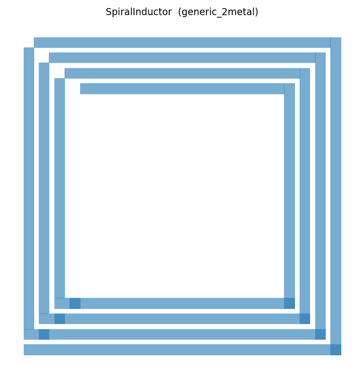](examples/showcase/04_spiral_inductor_3nh/output.svg) | [report](examples/showcase/04_spiral_inductor_3nh/report.md) · [simulation](examples/showcase/04_spiral_inductor_3nh/simulation.json) · [trace](examples/showcase/04_spiral_inductor_3nh/workflow_trace.json) | **SIMULATION_EXECUTED** — FastHenry 3.0.1 extracted 2.751264 nH versus 3.000000 nH target; 8.291% error, outside the 5% evidence tolerance. **NOT_FABRICATION_READY** |
| 5 | 6 GHz quarter-wave resonator | Create a 6 GHz quarter-wave resonator on silicon with a weakly coupled input line, open end, shorted end, and port labels. | [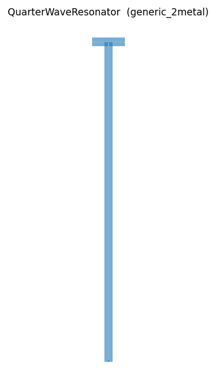](examples/showcase/05_quarter_wave_resonator_6ghz/output.svg) | [report](examples/showcase/05_quarter_wave_resonator_6ghz/report.md) · [simulation](examples/showcase/05_quarter_wave_resonator_6ghz/simulation.json) · [trace](examples/showcase/05_quarter_wave_resonator_6ghz/workflow_trace.json) | **SKIPPED_SOLVER_ABSENT** — analytical λ/4 length; no EM resonance execution. **NOT_FABRICATION_READY** |
| 6 | 2 mm × 2 mm research test chip | Create a 2 mm by 2 mm research test chip tile containing a 0.6 pF IDC, a 50 ohm CPW line, a spiral inductor, alignment marks, port labels, and a title text label. | [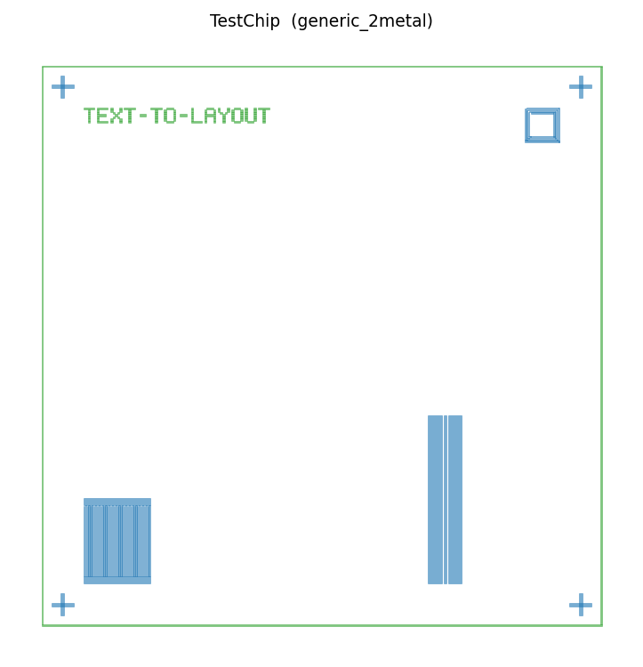](examples/showcase/06_research_test_chip/output.svg) | [report](examples/showcase/06_research_test_chip/report.md) · [simulation](examples/showcase/06_research_test_chip/simulation.json) · [trace](examples/showcase/06_research_test_chip/workflow_trace.json) · [tile map](examples/showcase/06_research_test_chip/tile_simulation_map.json) | **ANALYTICAL_ONLY for the full tile** — sub-block map retains real FasterCap IDC and FastHenry spiral outputs; CPW input is prepared; no full-tile EM solve. **NOT_FABRICATION_READY** |

No example is fabrication-ready. All generated layouts are research candidates
requiring process-specific DRC, expert review, EM correlation, and measurement
validation. Every example is marked **NOT_FABRICATION_READY**.
Each folder carries the full step chain: `prompt.txt`, `intent.json`,
`layout.json`, `output.gds/.svg/.png`, `klayout_readback.json`,
`verification.json`, `simulation.json`, `optimization.json`,
`workflow_trace.json`, `report.md`, and a per-example `README.md`.

## Evidence status vocabulary

| Status | Meaning |
| --- | --- |
| `GEOMETRY_PASS` | Layout generated and KLayout readback passed |
| `ANALYTICAL_ONLY` | Equation estimate only, no solver execution |
| `SIMULATION_INPUT_PREPARED` | Solver input files generated |
| `SKIPPED_SOLVER_ABSENT` | Solver not found, execution skipped honestly |
| `SIMULATION_EXECUTED` | Solver executed and output was parsed |
| `PHYSICS_VERIFIED` | Solver result meets target tolerance |
| `FAILED` | Workflow failed |
| `NOT_FABRICATION_READY` | Not approved for fabrication |

## What is verified and what is not

**Verified with committed solver evidence:** the capacitance of showcase
examples 1 and 3 (FasterCap 6.0.7 executed; stdout/stderr, command, return
code, runtime, and parsed matrix are committed next to each example).

**Executed but outside tolerance:** showcase example 4 has a real FastHenry
`Zc.mat` extraction (2.751264 nH versus 3.000000 nH); it is not physics-verified.

**Analytical or solver-skipped:** CPW impedance and resonator length. The test
chip has sub-block evidence but no whole-tile field solve.

**Not claimed at all:** self-resonance, loss/Q, EM transitions, JJ physics on
generic placeholders, fabrication readiness of anything.

## Component support matrix

Validated in CI by `scripts/validate_readme_claims.py` — every "yes" below must be backed by committed code, tests, and artifacts, or the build fails.

| Component            | Geometry | Analytical estimate                                                | Solver input                                      | Solver executed                                                    | Physics verified                                                 | Status                                                                 |
| -------------------- | -------- | ------------------------------------------------------------------ | ------------------------------------------------- | ------------------------------------------------------------------ | ---------------------------------------------------------------- | ---------------------------------------------------------------------- |
| IDC                  | yes      | yes (Bahl/Alley)                                                   | yes (FasterCap/FastCap)                           | environment-dependent (runs when installed; honest skip otherwise) | environment-dependent (never claimed without solver output)      | Supported — full closed loop                                          |
| CPW                  | yes      | yes (scikit-rf Ghione/Naldi with`[rf]`; Simons/Hilberg fallback) | yes (runnable openEMS/CSXCAD Octave model)        | environment-dependent (external openEMS stack)                     | environment-dependent (target/tolerance gated)                   | Supported — conditional solver closed loop                            |
| SpiralInductor       | yes      | yes (Mohan/Wheeler)                                                | yes (FastHenry)                                   | environment-dependent (external FastHenry)                         | environment-dependent (target/tolerance gated)                   | Supported — conditional solver closed loop                            |
| QuarterWaveResonator | yes      | yes (λ/4 line theory)                                             | yes (runnable openEMS/CSXCAD Octave model)        | environment-dependent (external openEMS stack)                     | environment-dependent (target/tolerance gated)                   | Supported — conditional solver closed loop                            |
| SQUID                | yes      | yes (RSJ/Josephson + rectangular-loop estimate)                    | conditional (JoSIM deck requires explicit Ic/R/C) | environment-dependent (JoSIM + explicit inputs)                    | no by default (circuit extraction is not geometry qualification) | Experimental — Option B; generic JJ geometry is not foundry-qualified |
| TestStructure        | yes      | yes (Bahl IDC + conformal CPW feed)                                | yes (FasterCap on the embedded IDC region only)   | environment-dependent (runs when installed; honest skip otherwise) | environment-dependent (IDC region only; transitions never claimed) | Supported — measurement structure with documented extraction region  |
| TestChip             | yes      | yes (per-sub-device analytical models)                             | yes (IDC, CPW, spiral sub-block decks)             | sub-block only (FasterCap IDC + FastHenry spiral); no full-tile run | no for the full tile                                             | Supported — sub-block evidence map; whole-tile coupling not modeled  |

IDC status: geometry **yes**; analytical estimate **yes**; FasterCap
input **yes**; FasterCap execution **conditional**; physics verification
**conditional**; fabrication ready **no**.

The compact IDC contract used by automated claim validation is repeated here
without presentation padding:

| IDC | yes | yes (Bahl/Alley) | yes (FasterCap/FastCap) | environment-dependent (runs when installed; honest skip otherwise) | environment-dependent (never claimed without solver output) | Supported - full closed loop |

Install optional Python RF support with `pip install "text-to-gds[rf]"`.
openEMS, FastHenry, FasterCap/FastCap, and JoSIM remain separately installed
external executables; no solver source is vendored or linked into this project.

## Trust and reproducibility

The honesty claims above are backed by committed, checkable artifacts:

- [CLEAN_ROOM_VERIFICATION.md](CLEAN_ROOM_VERIFICATION.md) — what was verified from a fresh clone (local CLI / API / plugin-style). This repo is **not** claimed to be "public ChatGPT plugin ready"; that requires a public HTTPS deployment (see [docs/public_gpt_action_deployment.md](docs/public_gpt_action_deployment.md)).
- [docs/artifact_policy.md](docs/artifact_policy.md) — why committed benchmark artifacts are byte-reproducible (normalized timestamps, stable GDS top-cell names, `gds2_write_timestamps=False`).
- [examples/acceptance/](examples/acceptance/) — three physics-fit acceptance packets: an infeasible target that is *refused* (5 MHz LC), a feasible resonator, and an auto-sized IDC.

## What it does

Text-to-Layout is not "AI randomly draws layout." The AI researches the target and proposes a typed Layout DSL. Deterministic code owns geometry, layer mapping, ports, verification, simulation preparation, and export.

```text
Research
  -> first-principles model
  -> initial parameter calculation
  -> Layout DSL (Pydantic v2)
  -> deterministic geometry
  -> gdsfactory Component
  -> verification gate
  -> SVG / PNG / GDS / JSON
  -> open-source simulation preparation or execution
  -> evidence-backed report
```

If required verification fails, final geometry artifacts are not exported.

> **Warning:** Generated layouts are design candidates, not fabrication-ready masks. Final fabrication requires process-specific DRC, EM simulation, expert review, and foundry or lab rule validation.

## Status vocabulary

This project uses explicit status labels to avoid misleading claims:

| Label                               | Meaning                                                         |
| ----------------------------------- | --------------------------------------------------------------- |
| **GEOMETRY PASS**             | Files exist, parameters verified, geometry is valid             |
| **ANALYTICAL ONLY**           | Equations computed; no solver executed                          |
| **SIMULATION INPUT PREPARED** | Solver input files exist; solver not executed                   |
| **SIMULATION EXECUTED**       | Solver ran and produced non-empty output file                   |
| **PHYSICS VERIFIED**          | Extracted values compared against target with tolerance         |
| **FABRICATION READY**         | Process-specific DRC, EM simulation, and expert review complete |
| **INFEASIBLE**                | Target not achievable under realistic constraints               |

**No `examples/benchmarks/` default artifact is PHYSICS VERIFIED, and nothing in this repository is FABRICATION READY.**

The only PHYSICS_VERIFIED artifacts are showcase examples
[01](examples/showcase/01_idc_0p6pf/) and
[03](examples/showcase/03_idc_cpw_test_structure/), each backed by committed
FasterCap output (stdout, stderr, command, return code, parsed matrix) and
enforced by claim validation.

## Legacy analytical benchmarks

> **Warning:** These are older analytical benchmark packets and should not be confused with the current research-grade showcase under [`examples/showcase/`](examples/showcase/).

Geometry Status | Simulation Status | Evidence Status | Fabrication Status

Each benchmark shows honest status across geometry, simulation, evidence, and fabrication.

| # | Target                                                                  | Prompt                                                                              | Output                                                                                                                            | Geometry Status                                                                                             | Simulation Status                                                                         | Evidence Status                                                                                                                | Fabrication Status       |
| - | ----------------------------------------------------------------------- | ----------------------------------------------------------------------------------- | --------------------------------------------------------------------------------------------------------------------------------- | ----------------------------------------------------------------------------------------------------------- | ----------------------------------------------------------------------------------------- | ------------------------------------------------------------------------------------------------------------------------------ | ------------------------ |
| 1 | [IDC capacitor](examples/benchmarks/01_idc_0p6pf/)                       | Create a 0.6 pF IDC with 22 finger pairs, 4 um width, 2 um gap, and 250 um overlap. | [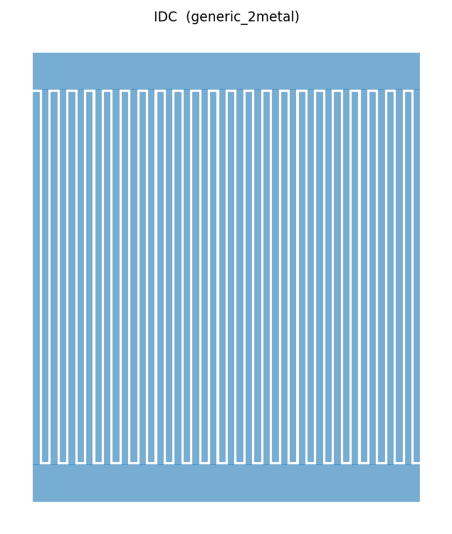](examples/benchmarks/01_idc_0p6pf/output.svg)                                 | **GEOMETRY PASS** (parameters, width, gap, layer, bbox, ports, gdsfactory lowering, KLayout readback) | **SIMULATION INPUT PREPARED** (FasterCap/FastCap input exists; solver not executed) | **ANALYTICAL ONLY** (Bahl/Alley estimate = 0.6983 pF; target error = 16.4%)                                              | **NOT READY**      |
| 2 | [50 ohm CPW](examples/benchmarks/02_cpw_50ohm/)                          | Create a 50 ohm CPW on silicon.                                                     | [](examples/benchmarks/02_cpw_50ohm/output.svg)                                 | **GEOMETRY PASS** (dimensions, GSG ports, layers, bbox, gdsfactory lowering)                          | **SIMULATION INPUT PREPARED** (openEMS manifest exists; solver not executed)        | **ANALYTICAL ONLY** (Simons conformal mapping estimate = 50.04 ohm; EM correlation pending)                              | **NOT READY**      |
| 3 | [Spiral inductor](examples/benchmarks/03_spiral_inductor/)               | Create a compact planar spiral with target inductance.                              | [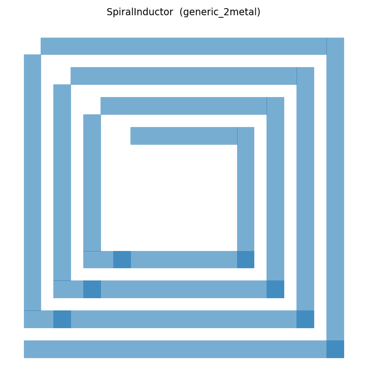](examples/benchmarks/03_spiral_inductor/output.svg)                  | **GEOMETRY PASS** (typed parameters, width, spacing, ports, bbox, gdsfactory lowering)                | **SIMULATION INPUT PREPARED** (FastHenry input exists; solver not executed)         | **ANALYTICAL ONLY** (Mohan/Wheeler estimate; no solver result)                                                           | **NOT READY**      |
| 4 | [Quarter-wave resonator](examples/benchmarks/04_quarter_wave_resonator/) | Create a 6 GHz quarter-wave CPW resonator.                                          | [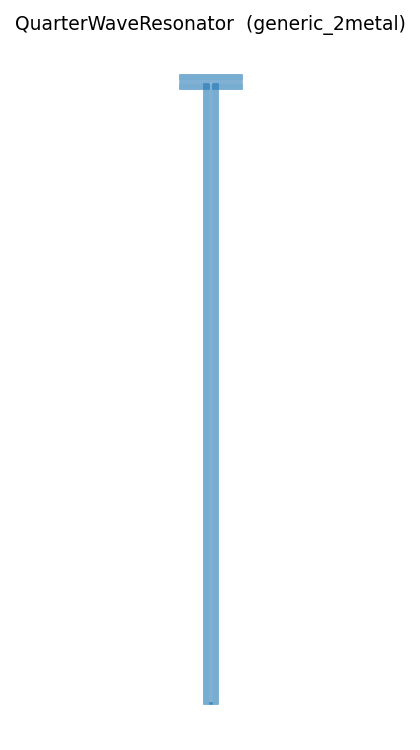](examples/benchmarks/04_quarter_wave_resonator/output.svg) | **GEOMETRY PASS** (open/short topology, coupling gap, GSG ports, bbox)                                | **SIMULATION INPUT PREPARED** (openEMS input exists; solver not executed)           | **ANALYTICAL ONLY** (L = vp/(4f) gives 4918.5 um; EM result pending)                                                     | **NOT READY**      |
| 5 | [SQUID loop](examples/benchmarks/05_squid_loop/)                         | Create a symmetric two-junction SQUID test structure.                               | [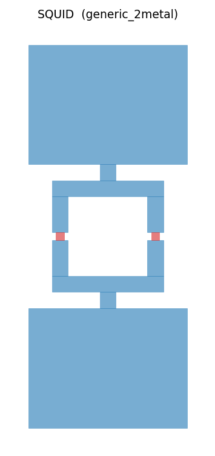](examples/benchmarks/05_squid_loop/output.svg)                             | **GEOMETRY PASS** (candidate; symmetry, two JJ placeholders, loop area, ports, layers)                | **NOT READY** (no foundry JJ-stack solver possible)                                 | **ANALYTICAL ONLY** (flux quantization model; generic JJ placeholders not foundry-qualified)                             | **NOT READY**      |
| 6 | [5 MHz LC resonator](examples/benchmarks/06_lc_5mhz_resonator/)          | Design a lumped LC resonator layout that targets 5 MHz resonance frequency.         | **NOT GENERATED** (infeasible target)                                                                                       | **NOT GENERATED** (no layout created)                                                                 | **NOT APPLICABLE** (no simulation possible)                                         | **INFEASIBLE** (required LC = 1.013×10⁻¹⁵ s² exceeds on-chip limits by 100-1000×; 159 MHz is the minimum feasible) | **NOT APPLICABLE** |

### Benchmark artifacts

Each benchmark folder contains:

```text
prompt.md             original request
layout.json           Layout DSL and provenance
output.svg/.png       human previews
output.gds            primary layout artifact
output.json           geometry IR and metadata
verification.json     measured checks and limits
analytical_estimate.md equations and calculated starting values
simulation_plan.md    readiness level, prepared inputs, expected extraction
evidence.md           equations, assumptions, references, limitations
report.md             target comparison and simulation status
```

### IDC benchmark details

- **Target:** 0.6 pF
- **Bahl/Alley estimate with 22 finger pairs:** 0.6983 pF
- **Error from target:** 16.4%
- **Proposed finger pairs for closer target:** 20
- **Proposed estimate:** 0.6319 pF
- **Current layout uses 22 finger pairs** because that was the user prompt
- **This is not yet EM verified**
- **For this legacy packet, FasterCap/FastCap input exists and no solver was executed**
- **Q3D/HFSS/Sonnet cross-check is still required** before fabrication

### 5 MHz LC resonator benchmark (INFEASIBLE)

- **Target:** 5 MHz resonance frequency
- **Required LC product:** 1.013×10⁻¹⁵ s²
- **Best achievable on-chip:** L = 10 nH, C = 100 pF → f0 = 159 MHz (31× higher)
- **Status:** INFEASIBLE for on-chip layout
- **Reason:** Required component values exceed practical limits by 100-1000×
- **Parasitic effects:** Wirebond/stray LC shifts resonance by >50%
- **Q-factor:** On-chip spiral Q ~ 2-10 at 5 MHz (too low)
- **Area penalty:** ~0.13 mm² minimum (vs. ~0.001 mm² for GHz circuits)
- **Alternative:** Discrete components, crystal, or active LC simulation

**This benchmark tests whether Text-to-Layout can reason about physical feasibility, not just draw layouts.**

### Simulation readiness

| Level      | Meaning                                    | Status                                          |
| ---------- | ------------------------------------------ | ----------------------------------------------- |
| 0          | Analytical estimate only                   | All benchmarks start here                       |
| 1          | Geometry generated and verified            | IDC, CPW, Spiral, Resonator, SQUID achieve this |
| 2          | Solver input prepared                      | IDC, CPW, Spiral, Resonator achieve this        |
| 3          | Solver executed and result artifact exists | Showcase examples 01 and 03 ([examples/showcase/](examples/showcase/)) |
| 4          | Result compared against target             | Showcase examples 01 and 03                     |
| 5          | Optimization loop implemented              | Showcase examples 01 and 03 (bounded solver-in-the-loop retune) |
| INFEASIBLE | Target not achievable                      | **5 MHz LC resonator**                    |

**No `examples/benchmarks/` default artifact is Level 3 or higher**; the solver-executed levels are reached only by the committed showcase examples. SQUID is Level 1 because a foundry-qualified junction stack is absent.

## What Text-to-CAD taught this project

[earthtojake/text-to-cad](https://github.com/earthtojake/text-to-cad) makes
its value obvious through a visual README, one prompt per benchmark, linked
benchmark test cases, one-line skill installation, local preview tooling, and
self-contained skill runtimes.

Text-to-Layout adopts the same reader-facing clarity and reproducibility. It
does not copy mechanical B-rep logic: IC layout needs named process layers,
minimum features, electrical ports, substrate assumptions, parasitic
analysis, EM extraction, and evidence status that distinguishes analytical,
planned, and executed work. See the
[full study](docs/lessons_from_text_to_cad.md).

## Supported generation

| Component              | Status                          | Notes                                                                                                |
| ---------------------- | ------------------------------- | ---------------------------------------------------------------------------------------------------- |
| IDC                    | Geometry ready, analytical only | Typed DSL, analytical starting model, ports, GDS/SVG/PNG/JSON, verification and evidence reports     |
| CPW                    | Conditional solver closed loop  | Typed DSL, GSG ports, scikit-rf correlation, runnable openEMS model, parsed S-parameters             |
| Spiral                 | Conditional solver closed loop  | Typed square spiral, Mohan estimate, FastHenry input, parsed`Zc.mat`                               |
| Quarter-wave resonator | Conditional solver closed loop  | Explicit open/short topology, runnable openEMS model, parsed resonance                               |
| SQUID                  | Option B experimental           | Symmetric loop, analytical L/Josephson estimates, conditional JoSIM RCSJ deck; not foundry-qualified |
| Test structure         | Conditional solver closed loop  | IDC + CPW launches; FasterCap extracts the documented IDC region only                                |
| Test chip tile         | Geometry + readback only        | IDC + CPW + spiral + alignment marks + stroke-font title; per-sub-device analytical estimates        |

## Install

Python 3.11+ is required.

```bash
git clone https://github.com/JungluChen/Text-to-Layout.git
cd Text-to-Layout
py -3 -m pip install -e .
```

With `uv`:

```bash
py -3 -m uv sync
```

Install the repository's agent skills:

```bash
npx skills install JungluChen/Text-to-Layout
```

## Generate the IDC example

```bash
textlayout generate examples/benchmarks/01_idc_0p6pf/layout.json --out out/idc
```

The command writes the requested geometry plus `*.layout.json`, `*.verification.json`, `*.evidence.md`, and `*.report.md` sidecars. A failed pre-export check returns exit code 2 and writes no final geometry artifact.

## Regenerate benchmarks

```bash
py -3 -m uv run python scripts/generate_benchmarks.py
py -3 -m uv run python scripts/check_benchmarks.py
```

Use `--strict` in CI when every benchmark must be complete. Without it, explicit TODO rows are skipped and cannot acquire fake output files.

## Run verification

```bash
textlayout verify examples/benchmarks/01_idc_0p6pf/layout.json
```

Checks cover typed required parameters, positive dimensions, minimum width and gap, layer mapping, bounding box, ports, geometry spacing, research/equation/reference presence, simulation-plan presence, gdsfactory component sanity, and final file existence.

## Run the API/plugin server

```bash
textlayout serve --host 127.0.0.1 --port 8000
# or
py -3 -m uv run uvicorn textlayout.backend.app:create_app --factory
```

Interactive OpenAPI docs: [http://127.0.0.1:8000/docs](http://127.0.0.1:8000/docs)

| Method | Endpoint                      | Purpose                                                                    |
| ------ | ----------------------------- | -------------------------------------------------------------------------- |
| GET    | `/health`                   | Discover generators, technologies, and formats                             |
| POST   | `/layout/research`          | Produce equations, assumptions, references, estimates, and simulation plan |
| POST   | `/layout/generate`          | Research, build, verify, and export requested artifacts                    |
| POST   | `/layout/verify`            | Run geometry/process checks without export                                 |
| POST   | `/layout/export?format=gds` | Export one verified artifact                                               |
| POST   | `/layout/simulate`          | Prepare or explicitly execute a supported open-source simulation           |
| POST   | `/layout/benchmark`         | Generate a complete benchmark packet                                       |
| POST   | `/layout/report`            | Return evidence, verification, files, and simulation steps                 |

```bash
curl -s -X POST http://127.0.0.1:8000/layout/generate \
  -H "Content-Type: application/json" \
  --data-binary @examples/benchmarks/01_idc_0p6pf/layout.json
```

See [tool API](docs/tool_api.md), [OpenAPI usage](docs/openapi_usage.md), and [plugin manifest](plugin_manifest.example.json).

## Layout DSL

```json
{
  "component": "IDC",
  "technology": "generic_2metal",
  "target": {"capacitance_pf": 0.6, "frequency_ghz": 6.0},
  "parameters": {
    "finger_pairs": 22,
    "finger_width_um": 4,
    "gap_um": 2,
    "overlap_um": 250,
    "bus_width_um": 25,
    "metal_layer": "M1"
  },
  "rules": {"min_width_um": 2, "min_gap_um": 2},
  "outputs": {"gds": true, "svg": true, "png": true, "json": true, "report": true},
  "evidence": {
    "analytical_model": "Bahl/Alley IDC estimate",
    "simulation_required": true
  }
}
```

## Skills

| Skill                                                                       | Enforces                                                |
| --------------------------------------------------------------------------- | ------------------------------------------------------- |
| [`layout-research`](skills/layout-research/SKILL.md)                       | Research and first-principles reasoning before geometry |
| [`gdsfactory-layout`](skills/gdsfactory-layout/SKILL.md)                   | DSL-first deterministic gdsfactory generation           |
| [`layout-verification`](skills/layout-verification/SKILL.md)               | Pre-export and post-export gates                        |
| [`layout-simulation-evidence`](skills/layout-simulation-evidence/SKILL.md) | Honest simulation planning and solver provenance        |
| [`jpa-design-simulation`](skills/jpa-design-simulation/SKILL.md)           | Official JPA design-to-simulation workflow guide        |

## Open-source simulation workflow

Open-source tools are the default base workflow. Commercial tools remain optional correlation/signoff connectors.

| Target                         | Open-source path                                 | Current status                                                                  |
| ------------------------------ | ------------------------------------------------ | ------------------------------------------------------------------------------- |
| IDC capacitance                | FasterCap/FastCap; Elmer as a future cross-check | Input preparation implemented; execution and physics verification are conditional |
| CPW and resonator S-parameters | openEMS + scikit-rf                              | Runnable Octave/CSXCAD model, guarded execution, Touchstone parsing             |
| Spiral L/R/Q                   | FastHenry/FastHenry2                             | Input generation, guarded execution,`Zc.mat` parsing                          |
| SQUID circuit response         | JoSIM                                            | Conditional RCSJ deck, guarded execution, CSV parsing; explicit Ic/R/C required |
| General FDTD/FEM               | Meep / Elmer                                     | Planned connectors                                                              |

Prepare IDC input without claiming a result:

```bash
py -3 -m uv run python simulation/idc_fastercap/generate_fastercap_input.py \
  examples/benchmarks/01_idc_0p6pf/layout.json \
  --out examples/benchmarks/01_idc_0p6pf/simulation
```

Attempt execution; this returns `status=skipped` and exit code 2 when the solver is absent:

```bash
py -3 -m uv run python simulation/idc_fastercap/run_fastercap.py \
  examples/benchmarks/01_idc_0p6pf/layout.json
```

### FasterCap/FastCap on Windows via WSL (Ubuntu)

FasterCap is built and executed as a Linux ELF binary. On Windows, run it from Ubuntu/WSL (the binary under `.tools/FasterCap/bin/FasterCap` is not a Windows `.exe`).

Build and verify (Windows):

```bash
python scripts/bootstrap_simulators.py --tools-dir .tools
python scripts/check_simulators.py --tools-dir .tools
```

If WSL `sudo` requires a password, follow the manual steps printed by the bootstrap. The essential WSL flow is:

```bash
sudo apt-get update
sudo apt-get install -y build-essential cmake pkg-config libwxgtk3.2-dev git file
cd /path/to/text-to-gds/.tools/FasterCap
rm -rf build
cmake -S . -B build -DFASTFIELDSOLVERS_HEADLESS=ON -DCMAKE_BUILD_TYPE=Release -DwxWidgets_CONFIG_EXECUTABLE="$(which wx-config)" -DCMAKE_CXX_FLAGS="$(wx-config --cxxflags)"
cmake --build build -j"$(nproc)"
cp -f build/FasterCap bin/FasterCap
chmod +x bin/FasterCap
file bin/FasterCap
./bin/FasterCap -bv
```

Notes:

- `file bin/FasterCap` must report an ELF executable (not `relocatable`).
- FasterCap does not accept `--help`; use `-bv` (version) or `-b?` (console usage).
- This repository applies a local-only CMake patch in `.tools/FasterCap/CMakeLists.txt` with markers `# TEXTLAYOUT LOCAL PATCH BEGIN/END` and keeps a backup at `.tools/FasterCap/CMakeLists.txt.textlayout.bak`.

Run the IDC capacitance extraction from WSL (Ubuntu):

```bash
cd /path/to/text-to-gds
sudo apt-get install -y python3-venv python3.12-venv python3-pip
python3 -m venv .wsl-venv
source .wsl-venv/bin/activate
python -m pip install -U pip
pip install pydantic numpy pyyaml pillow matplotlib trimesh
PYTHONPATH=src python simulation/idc_fastercap/run_fastercap.py examples/benchmarks/01_idc_0p6pf/layout.json --out workspace/fastercap_work --executable .tools/FasterCap/bin/FasterCap
```

Success is reported as `status="executed"` and `evidence_level="CAPACITANCE_EXTRACTED"` with a real `simulation_result.json` written under the `--out` directory.

- [HFSS](simulation/hfss_workflow.md)
- [Q3D](simulation/q3d_workflow.md)
- [ADS](simulation/ads_workflow.md)
- [Sonnet](simulation/sonnet_workflow.md)

## Simulator Setup

Fresh clone → working simulators in three commands:

```bash
make setup-simulators    # install/detect JoSIM; detect PSCAN2/WRspice (never blocks on them)
make check-simulators    # availability table; exit 0 even when optional simulators are absent
make demo-jpa            # JPA prompt -> layout -> verification -> extraction prep -> circuit sims
```

Windows without `make`: `python scripts/bootstrap_simulators.py`,
`python scripts/check_simulators.py`, then the `textlayout prompt` command from
the Makefile (or `./scripts/install_simulators.ps1`).

What to expect:

- **JoSIM is the first-priority backend.** The bootstrap installs it
  automatically from the official MIT-licensed releases (or builds from
  source, or prints exact manual steps). Everything lands in the git-ignored
  `.tools/` directory — no binaries are ever committed.
- **PSCAN2 and WRspice are optional.** They are detected if present
  (`TEXTLAYOUT_PSCAN2` / `TEXTLAYOUT_WRSPICE`, `.tools/`, PATH, or Python
  import for PSCAN2) and reported as `manual_install_required` if not.
  Missing PSCAN2/WRspice never blocks setup or the demo.
- **Honesty is unchanged by installation.** JoSIM/PSCAN2/WRspice are circuit
  simulators, not EM capacitance solvers — FasterCap/FastCap is still needed
  for geometry-level capacitance extraction. An installed simulator does not
  make anything `PHYSICS_VERIFIED`: that label requires a real extraction
  *and* a real simulation, both within declared tolerances. A real JoSIM LC
  run yields at most `JOSIM_RESONANCE_CHECKED`.
- Strict mode: `TEXTLAYOUT_STRICT_SIMULATORS=1`, the scripts' `--strict`
  flag, or `make demo-jpa-strict` turn missing simulators into nonzero exits.
- Details: [docs/simulators/install.md](docs/simulators/install.md) ·
  [troubleshooting](docs/simulators/troubleshooting.md) ·
  [licenses](docs/simulators/licenses.md) ·
  `make docker-simulators` for the reproducible Docker route.

## Circuit-level superconducting simulators (JoSIM / PSCAN2 / WRspice)

Two different physics questions, two different tool families — never mixed:

| Tool | Role | Boundary |
| --- | --- | --- |
| **FasterCap/FastCap** | Geometry-level electrostatic capacitance extraction from the drawn IDC polygons | The only acceptable evidence that the physical geometry has its target capacitance |
| **JoSIM** | Superconducting circuit transient simulation (RCSJ junctions, LC, SQUID) | Validates circuit behaviour from already-known L/C/JJ parameters; never a field solver |
| **PSCAN2** | Superconducting circuit transient simulation / margins / optimization (own HDL, normalised units, Python-driven) | Same boundary as JoSIM; not a SPICE dialect — templates are generated separately |
| **WRspice** | SPICE-family transient simulation with native Josephson-junction support | Same boundary as JoSIM; JJ syntax follows the published SNAIL-TWPA deck (see below) |
| **JosephsonCircuits.jl** | Future optional frequency-domain / harmonic-balance backend | Not required now; not wired into `textlayout` |

Background: the adapter design clean-rooms ideas from
[Levochkina et al., arXiv:2402.12037](https://arxiv.org/abs/2402.12037) and its
companion repository — reviewed in
[docs/references/jtwpa_numerical_simulations_review.md](docs/references/jtwpa_numerical_simulations_review.md).

### Install and detection

Each backend is found via an environment variable first, then common
executable names on `PATH` (PSCAN2 also via `import pscan2`):

| Backend | Environment variable | Fallback detection | Install |
| --- | --- | --- | --- |
| JoSIM | `TEXTLAYOUT_JOSIM` | `josim-cli`, `josim` | https://github.com/JoeyDelp/JoSIM |
| PSCAN2 | `TEXTLAYOUT_PSCAN2` | `pip install pscan2` (import check) | http://pscan2sim.org/ |
| WRspice | `TEXTLAYOUT_WRSPICE` | `wrspice`, `wrspice64` | http://wrcad.com/xictools/ |

### Usage modes

```bash
# Prepare-only: generate decks/runners for all three backends, execute nothing
py -3 -m uv run textlayout prompt "Create a 0.6 pF IDC on silicon at 6 GHz with 2 um min gap, extract capacitance if possible, then prepare JoSIM, PSCAN2, and WRspice LC resonance checks with 0.3 nH inductance" --out out/idc_multi_sim_demo --no-solver

# Execute-if-available (default): run whichever simulators are installed,
# honestly report SKIPPED_*_ABSENT for the rest
py -3 -m uv run textlayout prompt "..." --out out/idc_multi_sim_demo

# Strict: exit non-zero (3) when a requested simulator is not installed
py -3 -m uv run textlayout prompt "..." --out out/idc_multi_sim_demo --strict-simulation
```

Outputs land under `out/<dir>/simulation/{josim,pscan2,wrspice}/` with a
`manifest.json` each, plus the aggregated `simulation.json` and `report.md`.

### Evidence labels

Fixed vocabulary, enforced in `textlayout.simulation.evidence` (monotone: a
record may advance or fail, never silently demote):

- `*_INPUT_PREPARED` — files were generated; nothing executed.
- `SKIPPED_SOLVER_ABSENT` — the requested simulator is not installed; inputs
  still exist. (The per-backend constants `SKIPPED_JOSIM_ABSENT`,
  `SKIPPED_PSCAN2_ABSENT`, `SKIPPED_WRSPICE_ABSENT` all map to this shared
  value so the whole project reports absence with one word.)
- `*_EXECUTED` — a real subprocess/module execution happened.
- `*_TRANSIENT_PARSED` — the execution produced a parseable waveform.
- `*_RESONANCE_CHECKED` — a resonance was extracted and compared with `f0 = 1/(2π√(LC))`.
- `*_GAIN_CHECKED` — pump/signal transient data plus FFT-based gain extraction (not yet claimable in production — see limitations).
- `FAILED` — execution or parsing failed, with the reason recorded.
- `PHYSICS_VERIFIED` is reserved for a complete benchmark where geometry
  extraction **and** circuit-level checks both meet declared tolerances.

### Honest limitations

- Circuit simulators are never accepted as proof that the drawn IDC geometry
  has the target capacitance — that claim needs FasterCap/FastCap (or another
  field solver).
- The PSCAN2 generated runner refuses to fake execution: without a wired
  PSCAN2 driver API it exits with a distinct code and the evidence stays at
  `PSCAN2_INPUT_PREPARED`.
- The pump/signal gain extractor (`textlayout.simulation.postprocess`) is
  tested on synthetic data only; `*_GAIN_CHECKED` is not produced by any
  production path yet.
- WRspice JJ decks use the `B`-element + `jj(level=1)` model syntax confirmed
  from the published SNAIL-TWPA deck; they are readiness templates with
  placeholder junction parameters, not calibrated devices.

## Tests

```bash
py -3 -m uv run pytest tests/textlayout_suite
py -3 -m uv run ruff check src/textlayout scripts simulation tests/textlayout_suite
py -3 scripts/check_benchmarks.py
```

## Limitations and next work

- The generic technology is not a foundry PDK.
- Legacy `examples/benchmarks/` IDC capacitance is an analytical starting estimate; showcase examples 01 and 03 have the solver evidence stated above.
- The Level 2 FasterCap model uses zero-thickness panels and an effective dielectric; it requires mesh convergence and higher-fidelity correlation.
- Full-chip density, antenna, slot, enclosure, LVS, and process-specific DRC are outside the clean plugin package today.
- The next component should be promoted only after typed ports, extraction, literature comparison, and a reproducible benchmark are complete.
- **PHYSICS_VERIFIED exists only for showcase examples 01 and 03** (committed FasterCap runs on the IDC region); everything else is analytical or honestly skipped.
- The FasterCap model uses zero-thickness panels and an effective dielectric — a correlation model, not signoff; finite-thickness/full-wave cross-checks are still required.
- **Nothing in this repository is FABRICATION READY** — every layout requires process-specific DRC, EM cross-check, measurement planning, and expert review.

## Development SOP

From a fresh clone: install (`pip install -e ".[dev]"` or `py -3 -m uv sync`),
run `textlayout doctor`, run one prompt
(`textlayout prompt "Create a 0.6 pF IDC on silicon at 6 GHz with 2 um min gap" --out out/demo`),
then gate with `uv run ruff check .`, `uv run pytest`,
`uv run python scripts/validate_readme_claims.py`, and `uv build`. The full
procedure, including showcase regeneration and the commit workflow, is in
[SOP.md](SOP.md).

## References

Analytical models and open-source solvers are documented in
[REFERENCES.md](REFERENCES.md), with full per-benchmark citations inline in each
`examples/benchmarks/*/evidence.md`.

> A paper citation supports the **analytical method** (the equation used). It does
> **not** prove that a generated geometry meets its target. Only a real solver
> result or a measurement can establish that, which is why every analytical result
> is labelled `ANALYTICAL ONLY` until a solver-owned artifact exists.

Key sources: Bahl (2003) and Alley (MTT-18, 1970) for the IDC; Simons (2001) and
Hilberg (MTT-17, 1969) for the CPW; Mohan et al. (JSSC, 1999) and Wheeler (1928)
for the spiral; Pozar (2012) for λ/4 and LCR resonance; Clarke & Braginski (2004)
and Tinkham (2004) for SQUID/Josephson physics.

## License

MIT; see [LICENSE](LICENSE).
