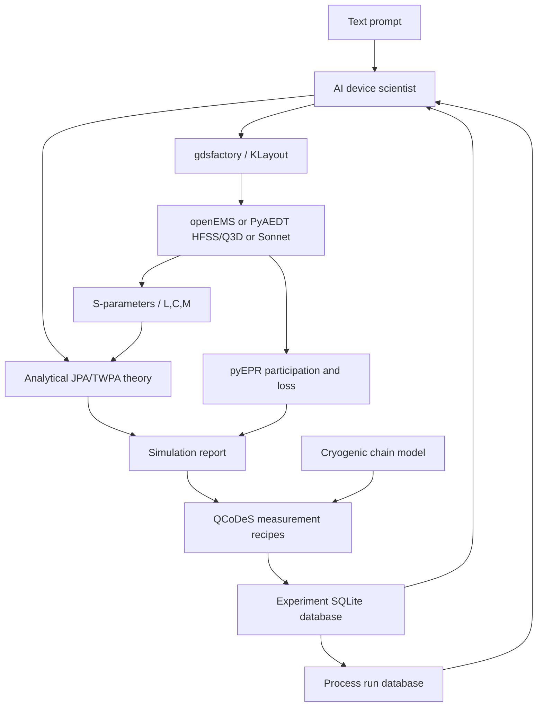

# Closed-Loop JPA/TWPA Research Workflow



## Process-Aware Design

Process records live under `process_database/`. They contain oxidation
conditions, target and measured `Jc`, standard deviation, wafer position, and
lithography/capacitance variation. Example:

```python
from text_to_gds.server import plan_ljpa

plan = plan_ljpa("Design a 6GHz JPA using NCU 2025 AlOx process")
print(plan["fabrication_process"]["expected_ic_yield_percent"])
```

The bundled NCU record is explicitly example data and must be replaced by a
measured run record before fabrication.

## Theory, Simulation, Measurement

`run_analytical_verification` computes a Kerr-JPA gain curve, 3 dB bandwidth,
square-root-gain bandwidth product, and the half-photon quantum noise limit.
Optional simulation and measurement JSON inputs are added to the same report;
missing inputs remain missing instead of being synthesized.

The `text_to_gds.theory` package also exposes standalone 3WM and 4WM
undepleted-pump gain functions.

## Uncertainty And Yield

`run_uncertainty_analysis` samples measured `Jc`, two-dimensional lithography
variation, and capacitance variation using a deterministic seed. It writes:

- `.uncertainty.json`
- `.uncertainty.csv`
- `.yield_report.png`

Reports include mean, sample standard deviation, 95% intervals, and accepted
yield. The gain propagation is reduced-order and is not nonlinear-simulator
signoff.

## EM And EPR

`export_pyaedt_project` writes an explicit GDS/process/port configuration plus
HFSS driven-modal, HFSS eigenmode, and Q3D scripts. Licensed execution can
produce `.aedt`, `.s2p`, eigenmode JSON, capacitance matrices, and E/H/current
field images. `export_q3d_extract` exposes the capacitance-only route.

`recommend_pyaedt_design_correction` converts extracted frequency and
impedance errors into first-order CPW length, capacitance/inductance, and gap
scale seeds for Optuna. Every correction requires a regenerated GDS and another
EM solve.

The default PEC/copper conductor substitutions, generated lumped ports,
substrate loss, and mesh convergence are explicit review gates. Proprietary
project binaries and solved evidence are produced only by installed licensed
Ansys Electronics Desktop. `export_sonnet_project` remains the planar solver
handoff.

`export_epr_analysis` follows the upstream pyEPR contract:

```text
ProjectInfo
  -> DistributedAnalysis.do_EPR_analysis()
  -> QuantumAnalysis.analyze_all_variations()
```

When a field-energy JSON is supplied, Text-to-GDS independently reports
junction participation, dielectric participation/loss, dielectric-limited Q,
predicted T1, and first-order anharmonicity. HFSS-backed chi extraction is
performed by the generated pyEPR script.

## Measurement And Cryogenics

Templates under `measurements/` cover gain, flux, pump, noise temperature,
compression, and squeezing. Each produces JSON, long-form CSV, and a plotted
map in deterministic dry-run mode. Real instrument use requires binding
QCoDeS Parameters and applying lab power/interlock limits.

`analyze_cryostat_input_chain` calculates attenuator thermalization, available
JPA-plane power, JPA compression headroom, downstream Friis noise, and system
noise referred to the JPA input from `cryostat/input_chain.yaml`.

## Experiment Feedback

`record_experiment_feedback` stores design and measurement JSON in SQLite and
returns frequency and junction-area correction factors. This closes the local
data contract:

```text
process -> design -> GDS -> measurement -> model correction -> next design
```

## Paper Benchmarks

Each directory under `benchmarks/papers/` contains `paper_parameters.yaml` and
`expected_results.json`. `run_paper_benchmarks` returns `passed`, `failed`, or
`skipped` for each paper. Missing nonlinear backends and undigitized
measurement curves are skipped explicitly; they never pass from copied target
values.

HFSS/Q3D qualification definitions live under `benchmarks/pyaedt/`.
`run_pyaedt_benchmarks` skips them until licensed solver result JSON is present,
then compares actual values and tolerances without copying target values into
the result.
