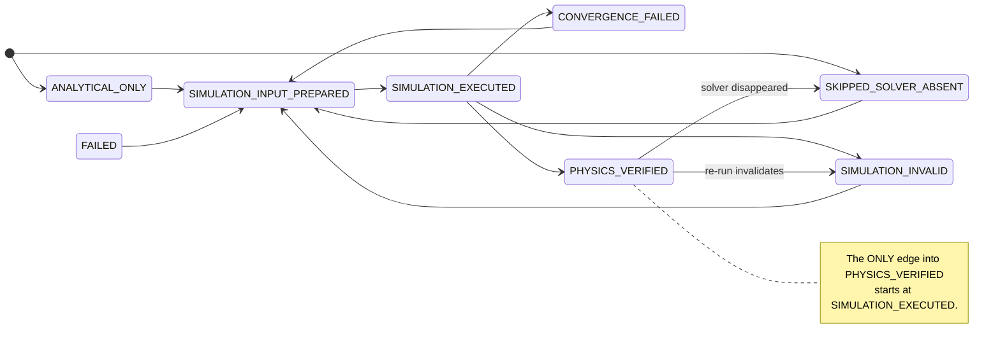

# The evidence model

Every physics claim in this repository is a `QuantityEvidence` record. The model
does not *document* the honesty rules — it **enforces** them in a pydantic
validator, so a false claim cannot be constructed at all.

Source: [`src/textlayout/evidence.py`](../src/textlayout/evidence.py).

## The one invariant

> Confidence may always be **lost**, and may only be **gained** along the
> sanctioned path: prepare inputs → run a solver → compare to target.

Losing confidence is always honest — a re-run that fails must always be able to
invalidate an earlier claim. So demotion needs no allow-list. Only the
confidence-*increasing* edges are enumerated, and everything else that would
raise confidence is an illegal promotion.

## Statuses and confidence classes

| Status | Confidence | Means |
| --- | --- | --- |
| `FAILED` | `NONE` | Solver ran, produced no accepted result. |
| `SKIPPED_SOLVER_ABSENT` | `NONE` | Solver not installed. **An honest skip, not a failure.** |
| `SIMULATION_INVALID` | `NONE` | Solver ran; output failed a physical-sanity check. |
| `CONVERGENCE_FAILED` | `NONE` | Solver ran; result did not converge under refinement. |
| `ANALYTICAL_ONLY` | `ANALYTICAL` | Closed-form estimate. **Never a solver result.** |
| `SIMULATION_INPUT_PREPARED` | `PREPARED` | Solver inputs exist on disk. Still not a result. |
| `SIMULATION_EXECUTED` | `SIMULATED` | Solver produced a finite, parseable value. |
| `PHYSICS_VERIFIED` | `VERIFIED` | That value agreed with its target inside tolerance. |

`ConfidenceClass` is an `IntEnum`, so "did this transition raise confidence?" is
a comparison rather than a hand-maintained table of forbidden pairs.

## The lattice



Solid arrows upward are the 11 sanctioned promotions. Every downward edge is
permitted implicitly and is not enumerated.

## Structural guards

Constructing a record runs these checks, in this order:

1. **Non-finite rejection.** No numeric field may be `NaN` or `±inf`.
   This runs *first*, because `NaN` compares `False` against every bound: an
   unguarded `error_percent > tolerance_percent` check silently **admits** a
   `NaN` error as `PHYSICS_VERIFIED`. That was a real defect — see
   [`improvement_baseline.md`](improvement_baseline.md).
2. **Rejected statuses** (`SIMULATION_INVALID`, `CONVERGENCE_FAILED`) must name
   a solver and must **not** carry an extracted value. A rejected number is not
   a measurement of anything; the raw token is preserved in `notes`.
3. **Solver-output statuses** (`SIMULATION_EXECUTED`, `PHYSICS_VERIFIED`) require
   a named solver, a named parser, an extracted value, and at least one output
   file that **exists and is non-empty on disk**.
4. **`PHYSICS_VERIFIED`** additionally requires a target and an `error_percent`
   within `tolerance_percent`.
5. **`ANALYTICAL_ONLY`** must not name a solver or claim solver output files.
6. **`SKIPPED_SOLVER_ABSENT` / `SIMULATION_INPUT_PREPARED`** must not carry an
   extracted value: no solver ran, so there is nothing to extract.

`compare_extracted_to_target()` is the only path to `PHYSICS_VERIFIED`. It
*computes* the status and never accepts one:

- non-finite extracted value → `SIMULATION_INVALID`
- inside tolerance → `PHYSICS_VERIFIED`
- outside tolerance → `SIMULATION_EXECUTED`

## The ledger

`EvidenceLedger` is an append-only history of one quantity's claims. `record()`
validates each transition against the lattice; `from_dict()` re-validates the
**whole chain**, so a ledger file hand-edited to promote a claim will not load.

```python
from textlayout.evidence import EvidenceLedger, EvidenceStatus

ledger = EvidenceLedger("capacitance")
ledger.record(prepared)    # SIMULATION_INPUT_PREPARED
ledger.record(executed)    # SIMULATION_EXECUTED   -> ok
ledger.record(verified)    # PHYSICS_VERIFIED      -> ok

ledger.current.confidence_class   # ConfidenceClass.VERIFIED
```

Attempting to skip the solver:

```python
ledger = EvidenceLedger("capacitance")
ledger.record(skipped)     # SKIPPED_SOLVER_ABSENT
ledger.record(verified)    # EvidenceError: illegal confidence promotion
                           # SKIPPED_SOLVER_ABSENT -> PHYSICS_VERIFIED
```

## Validating stored evidence in CI

```bash
uv run textlayout evidence check path/to/ledger.json
```

| Exit | Meaning |
| --- | --- |
| `0` | Schema valid; every recorded transition is legal. |
| `3` | Schema invalid, or a claim was promoted illegally. |

Schema id: `textlayout.evidence-ledger.v1`.

## Reproducing the tests

```bash
uv run pytest tests/textlayout_suite/test_evidence_transitions.py   # 83 tests
uv run pytest tests/textlayout_suite/test_evidence_contract.py      # 18 tests
```

`test_evidence_transitions.py` sweeps all 8 × 8 = 64 status pairs against an
**independently restated** promotion set, so widening the lattice in
`evidence.py` alone fails the suite — the graph must be changed deliberately in
two places.

## What this model does *not* claim

A `PHYSICS_VERIFIED` quantity means one solver agreed with one target inside
tolerance. It does **not** mean the design is fabrication-ready. Nothing is
fabrication-ready without a process-qualified PDK and all required signoff
checks. See [`pdk_abstraction.md`](pdk_abstraction.md).
