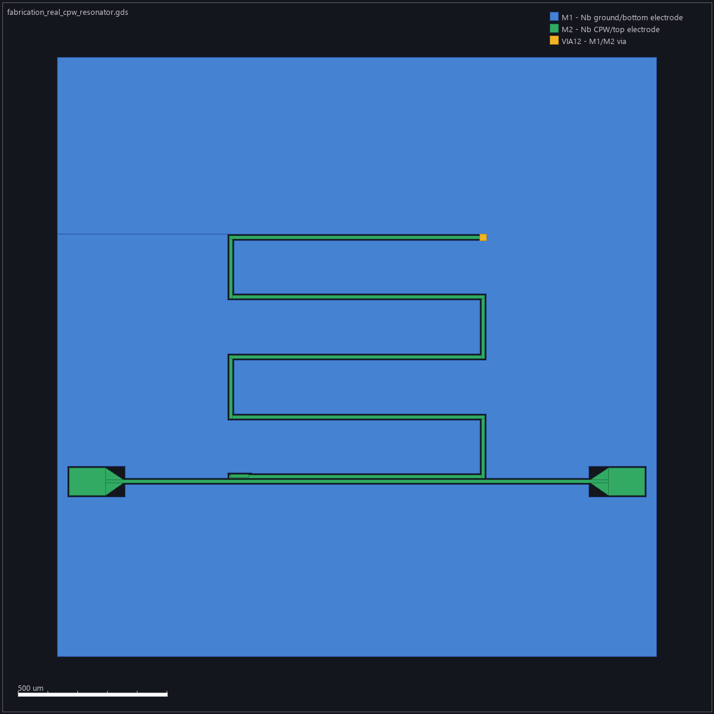

# Text-to-Layout guidebook

**Document class: MANUAL_DOCUMENTATION.** Initial guidebook and production
documentation contract. Current CLI/API examples below are grounded in source;
this documentation change has not rerun simulations or certified plugin hosts.
New desktop/web screenshots are pending implementation, not fabricated here.

Read [product requirements](../../REQUIREMENTS.md), [Design.md](../../Design.md)
and the [function/MCP catalog](../function-catalog.md) for coverage and status.

## Choose an interface

| Interface | Starting point | Current boundary |
| --- | --- | --- |
| CLI | `uv run textlayout --help` | Existing product entry point; solver/platform availability varies. |
| Local API | `uv run textlayout serve --host 127.0.0.1 --port 8000` | API docs at `/docs`; this is not the finished workbench. |
| Desktop | Windows/macOS/Linux application | Planned delivery; installer walkthroughs/screenshots pending. |
| Browser | Local and hosted workbench | Planned shared UI; hosted deployment and execution not assumed available. |
| MCP | Installed `text-to-gds` stdio server | Existing legacy tool surface; discover schemas before calling tools. |
| Codex / Claude Code | Thin plugin under `plugins/text-to-gds` | Manifests exist; verify each host installation/workflow before claiming support. |

## First CLI design: explicit geometry without simulation

Run from the repository root in a terminal with Python and `uv` installed.
Python 3.12 is the project recommendation; optional solvers need separate setup.
On Windows, use PowerShell; use `py -3 -m uv` instead of `uv` if that is how uv
is installed. These commands use no shell-specific line continuation.

1. Install the locked environment:

   ```sh
   uv sync --frozen --python 3.12
   ```

2. Read available commands and inspect environment/solver readiness:

   ```sh
   uv run textlayout --help
   uv run textlayout doctor --json
   ```

   Keep the doctor output. A missing optional solver is not a passing simulation.

3. Request a bounded example without executing a solver:

   ```sh
   uv run textlayout prompt "Create a 0.6 pF IDC on silicon at 6 GHz with 2 um min gap" --out out/guidebook/idc --no-solver
   ```

   Inspect the returned file paths and report under `out/guidebook/idc`. Separate
   geometry checks and analytical target estimates from actual solver evidence.
   Do not interpret a requested 0.6 pF value as an independently measured result.

4. For deterministic DSL-driven generation, inspect the input, validate it, then
   generate an artifact packet:

   ```sh
   uv run textlayout verify examples/benchmarks/01_idc_0p6pf/layout.json
   uv run textlayout generate examples/benchmarks/01_idc_0p6pf/layout.json --out out/guidebook/idc-dsl
   ```

5. Open the returned GDS/preview and read the verification/report artifacts.
   Follow [solver installation](../simulators/install.md) before attempting a
   real simulation. Recheck solver readiness and retain logs, convergence and
   independent comparison evidence. See [Palace troubleshooting](../troubleshooting/palace.md).

### Picture-reading example



This existing layout artifact illustrates the kind of geometry a walkthrough
must explain. Its presence does not certify a new run. In the completed
workbench tutorial, numbered pointers must identify **1: input/units**,
**2: geometry/layer controls**, **3: run status**, and **4: evidence/export**
in the actual application screenshot; pair each pointer with a written action.

## Local API walkthrough

1. Start the service from the repository root:

   ```sh
   uv run textlayout serve --host 127.0.0.1 --port 8000
   ```

2. Open `http://127.0.0.1:8000/docs` in your browser and inspect `/health`.
3. Open the `POST /layout/research` operation, choose **Try it out**, and enter
   the JSON from `examples/benchmarks/01_idc_0p6pf/layout.json`.
4. Execute the request. Read equations, assumptions and proposed simulation
   steps before using `/layout/generate`. Use the live `/openapi.json` schema
   for exact request/response fields; [Tool API](../tool_api.md) adds context.
5. Stop the local server with Ctrl+C when finished. A hosted agent cannot access
   this Mac's localhost without an explicitly configured connection.

## AI prompt examples

These are prompts to an agent with project/tool access; tool and solver access
must be verified first. AI text alone is not simulation evidence.

**Discover capabilities**

> List the available Text-to-Layout MCP tools and installed solvers. Distinguish
> supported product functions from legacy tools, and list missing prerequisites.
> Do not start a simulation during discovery.

**Prepare a design**

> Create an IDC targeting 0.6 pF on silicon at 6 GHz with at least 2 um gap.
> Show material assumptions and units first. Use deterministic geometry tools,
> verify the exported layout, and return artifact paths. Prepare solver inputs
> without claiming a simulation ran.

**Validate a real run**

> Check that the required open-source solver is runnable, then execute the
> prepared case. Report its version, inputs, convergence, actual numerical
> result, reference source and comparison error. Preserve a failed or unavailable
> status and its logs; do not substitute an estimate for missing solver evidence.

**Recover work**

> Inspect the existing run and job IDs, resume only supported unfinished work,
> and avoid launching a duplicate. Tell me what completed, what remains and the
> exact next action, with links to evidence.

## MCP and plugin walkthrough contract

The existing plugin config launches the legacy `text-to-gds` server. Root
`.mcp.json` currently assumes the Windows `py -3 -m uv` launcher; it is not
a portable macOS/Linux install recipe. Host-specific launch configuration,
absolute working-directory/package discovery and installation must be tested.

1. Install the documented package/plugin version using the target host's current
   supported flow; record Codex or Claude Code version and OS.
2. Connect the server and inspect `tools/list`. Compare its names and schemas
   with the [catalog](../function-catalog.md).
3. Call the existing `list_simulators` discovery tool with no arguments:

   ```json
   {"jsonrpc":"2.0","id":2,"method":"tools/call","params":{"name":"list_simulators","arguments":{}}}
   ```

   This is a request after a successful MCP initialization handshake, not a
   standalone HTTP endpoint or complete stdio session. The client manages the
   handshake and transport. Inspect the returned content; availability is not
   numerical validation.
4. Use the discovery prompt above, then one bounded geometry example. Validate
   the actual schema before providing arguments; retain host screenshots and
   the resulting artifact/evidence records.
5. Repeat on both plugin hosts; report unsupported or missing capabilities.

## Required illustrated chapters and capture checklist

All rows below are **pending real capture/validation** for the delivered UI.
Do not ship a placeholder as a completed screenshot tutorial.

| Chapter | Required screenshots and numbered pointers | Matching examples |
| --- | --- | --- |
| Windows/macOS/Linux installation | Installer, project selection, readiness and missing dependency recovery | CLI install/help/doctor per OS |
| First design | Prompt, units/material assumptions, validation, geometry preview | IDC CLI command and design AI prompt |
| Edit and inspect | Selected geometry, parameter field, layer visibility, before/after result | CLI DSL validation and matching MCP operation |
| Simulate and recover | Solver choice, execution location, progress, missing solver, failure/retry | Real solver command, job ID and failure AI prompt |
| Compare and export | Convergence, source/reference, numerical error, export destination | Result/evidence inspection and comparison AI prompt |
| Local and online browser | Connection state, local versus hosted run, artifact access | Local server command and authenticated hosted procedure |
| Codex and Claude Code | Plugin installation, MCP discovery, tool invocation, results | `tools/list`, validated `tools/call`, AI prompt |
| Function browser | Search/filter, function details, prerequisites, copy example | Catalog mapping and schema example |

Store original captures under `docs/guidebook/images/`. Pair every annotated
capture with a metadata record naming commit, OS, app/host version, viewport,
theme, date, input case, exact capture steps and numbered callout descriptions.
Keep callouts off important text and numerical evidence. Include alternative
text and a numbered prose explanation; users must not depend on seeing arrows.

Before marking a chapter complete, rerun every command/tool example, check
expected files/status and failures, validate image links and review screenshots
at normal size and 200% zoom. Update screenshots when the documented UI changes.
