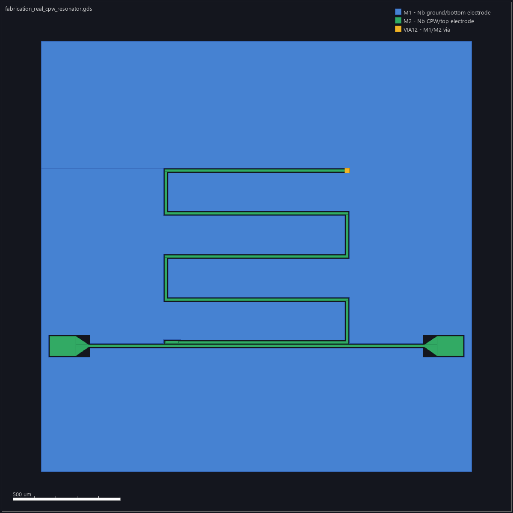

# Checking a resonator result against a paper

**Document class: MANUAL_DOCUMENTATION.** This walkthrough uses real retained
Palace CI evidence to show how a failed result is rejected. It does **not**
claim that the quarter-wave benchmark is already accurate. A versioned desktop
screenshot is pending until an installed app exists.



The image helps identify the center trace, two ground gaps and resonator path.
Record actual width, gap, length, substrate, metal and boundary dimensions from
the solver input; the illustration alone cannot supply them.

1. From the repository root, inspect the documented workflow and installed
   solver state:

   ```sh
   uv run textlayout doctor --json
   uv run textlayout simulate palace-resonator --help
   ```

   A found Palace binary establishes availability only. Save its version and
   executable hash with the run.

2. Open the [retained repeated failure report](../progress/2026-09-26-141550.md)
   and its [attempt-2 evidence](../progress/evidence/2026-09-26-141550/palace-attempt2/).
   Confirm the base mesh hash, Palace 0.17.0 binary hash, material and geometry
   configuration, solved-state CSV files, resource records and final status.
   The two unchanged attempts reached 434,227 elements against a 200,000
   diagnostic limit. The status is `SIMULATION_INVALID`, so do not quote either
   eigenfrequency as a validated resonance.

   A later bounded run stayed under that limit but still failed physical mode
   identification. Open its [first diagnostic packet](../progress/evidence/2026-09-27-080338/palace-attempt1/)
   and inspect `mode_tracking.json` → `mode_diagnostics_by_iteration` →
   `iteration_00`. Candidate mode 1 has the expected electric and magnetic
   endpoint ratios (19.05 and 46.66) and magnetic profile correlation 0.9866,
   but its electric profile correlation is 0.7423, below the predeclared 0.90
   gate. Candidate mode 2 is classified as a substrate mode. These observations
   explain the rejection; they do not justify lowering the gate or claiming
   a resonator frequency. The `iteration_00/eig.csv` file describes the first
   solved state; `final_state/eig.csv` describes the later adapted state. Keep
   their frequencies separate when reviewing the field profile.

3. For a fresh run, follow [Palace installation and recovery](../troubleshooting/palace.md)
   and execute the repository's pinned `palace-integration` workflow on the
   intended commit. Do not start another solver job while one is active. Download
   the compact evidence artifact and retain the original log, resolved Palace
   JSON, mesh metrics and eigenvalue files. Record exact commands and hashes.

4. Check numerical convergence **before** comparing with a publication:
   track the same physical mode across refinements, verify mesh/DOF growth and
   energy/field overlap, calculate last-level frequency change and global AMR
   error, and run the specified domain-size sweeps. Set frequency/error
   tolerances from the reference uncertainty and numerical method before
   reading the result. A process exit of zero, a single eigenvalue, or an
   analytical transmission-line estimate is insufficient.

5. Choose a paper that measures or calculates the **same quantity** under
   compatible geometry, substrate, temperature and boundary conditions. The
   repository's [CPW reference record](../../references/cpw/simons_reference.json)
   cites Simons for CPW transmission-line geometry and
   [Khalil et al. (2012)](https://doi.org/10.1063/1.3692073) for extraction of
   internal quality factor from asymmetric measured transmission. Khalil's
   quality-factor fitting method is **not** an independent reference for this
   Palace eigenfrequency. Do not substitute its paper title for a matching
   numerical target. A matching public quarter-wave case and its tolerance
   remain to be selected and recorded.

6. Only after the mode, convergence and matching reference are established,
   calculate signed and absolute relative frequency errors with units and
   uncertainty, then publish the evidence packet. Report any unavailable
   direct HFSS/Keysight comparison as pending.

**AI prompt example**

> Inspect the Palace job already running for this commit. Do not launch a
> duplicate. Return the solver version/hash, geometry and material assumptions,
> mesh/DOF history, target-mode identity, field overlap, energy and domain
> convergence, original logs, and the exact source and uncertainty of a
> matching public frequency reference. Calculate the comparison error only
> after those checks pass. If any check is missing, mark the result invalid or
> pending and give the exact next experiment.

Recovery: if the workflow fails, keep the artifacts and its job ID, rerun the
same command unchanged once, compare hashes and numeric outputs, then diagnose
before editing. Use the [repository diagnostic sequence](../development/reproduce_before_edit.md).


Latest retained two-state diagnostic (2026-09-28 audit): run 36295978520 at
`d40b165` has 106,614 and 114,276 elements, with mode-1 electric profile
correlations 0.7422995731 and 0.8745187355. Both remain below 0.90; mode 2 is
classified as substrate in both states. Refinement improved this diagnostic
metric but did not establish a target mode or convergence. The unchanged
second attempt reproduced the rejection with matching model/configuration hashes
and floating-point-scale profile differences. See [the repeated evidence](../progress/2026-09-30-011648.md).


The later main [run 36604920743](https://github.com/JungluChen/Text-to-Layout/actions/runs/36604920743)
confirmed native discovery and real Palace execution, but the runner shut down
during refinement at 3,366,845 elements. Final convergence/reference evidence
was not uploaded. [The retained runtime report](../progress/2026-10-01-011559.md)
separates observed memory pressure from an unproven OOM diagnosis. Do not
interpret this interrupted run as a validated resonance or repeat the same
unbounded workload before reviewing resource limits and evidence retention.
