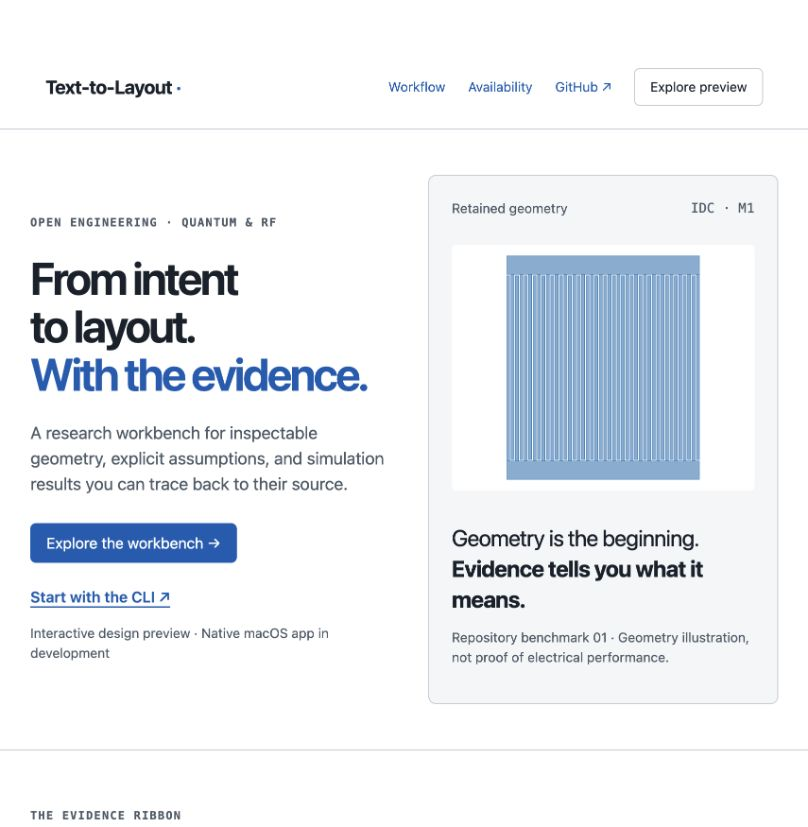

# Explore the browser design preview

Document class: MANUAL_DOCUMENTATION. Browser preview, 2026-09-28.
Requires a modern browser and JavaScript; no solver installation or account.

1. Open the landing page and choose **Explore the workbench**. The initial
   Layout screen shows retained CPW geometry. Confirm the input hash and
   **Disconnected preview** notice.
2. Choose **Solver output** in the evidence ribbon. Expect
   `input_files_prepared`, `solver_executed: false`, and zero solver output files.
   Choose **Reference comparison**: it remains **Unknown**, with missing evidence.
3. Select **Polygon 2** in the table. The canvas selection and inspector show
   the same object's original vertices in µm. Fit/reset restores the full view.
4. Open **Project / Intent**, change Gap from6 to8 µm. Expect **From an earlier
   revision**. The original geometry remains unchanged. **Restore original
   inputs** clears the draft. Reload discards all draft edits.
5. Open **Runs** to inspect original inputs, verification, methods, geometry
   and source hashes. Elapsed time is Unknown, and the process has not executed.

On narrow screens, use **Navigation** to reveal the screen links. Keyboard
users can Tab to object buttons and activate with Enter. Evidence is provided
as text and raw JSON as well as geometry.

If artifacts fail to load, reload over HTTP/HTTPS (not file://), check that
`assets/` is deployed, or open the source benchmark in GitHub. A load error must
never appear as a passed scientific result. The preview cannot access local
files, invoke solvers, or retain drafts across reloads.

CLI counterpart, from a source checkout with dependencies installed:

```sh
uv run textlayout generate examples/benchmarks/02_cpw_50ohm/layout.json --out out/cpw
```

This produces geometry and analytical/verification artifacts, not EM acceptance.
Example AI prompt: “Inspect this CPW verification report. Separate geometry
checks, analytical estimates, prepared inputs and actual solver outputs. List
missing evidence without promoting its status.” No new MCP method is advertised.

Browser captures are retained in the associated progress evidence. Annotated
installed-native-app screenshots remain pending until a real signed build runs.

Live site: https://text-to-layout.vercel.app/ · [Open workbench](https://text-to-layout.vercel.app/app.html).



Capture: macOS, Codex in-app browser,2026-09-28, deployment
`dpl_BVteoryZANRzzJNMBEN7DMfZoJVb`, system light appearance. This is an
unannotated browser preview; installed-native tutorial and numbered annotations
are pending. The original capture is retained without alteration.

## Interactive 3D geometry

1. Open Project / Layout and expand **3D geometry · Three.js**.
2. Wait for **3D renderer ready**. Drag to orbit and scroll to zoom, or use
   Rotate left/right, Zoom 3D in/out, Top view and Reset 3D view with the keyboard.
3. Select a polygon in either canvas or the semantic object table. The original
   inspector coordinates and both visual highlights refer to the same polygon.
4. Check the missing-stack notice: this snapshot has x/y polygons only, displayed
   at z=0 µm. No metal thickness, substrate volume or EM result is fabricated.

If WebGL is unavailable, use the retained 2D view/table. Close and reopen the
section after a module-load failure; reload after graphics-context loss.
Browser 3D rendering is now implemented; native macOS stack integration remains
pending. Rendering uses pinned Three.js, served from this site's own bundle.
